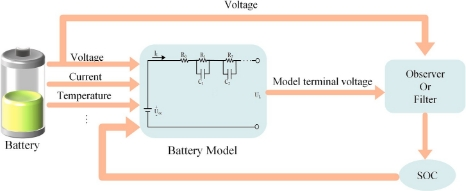
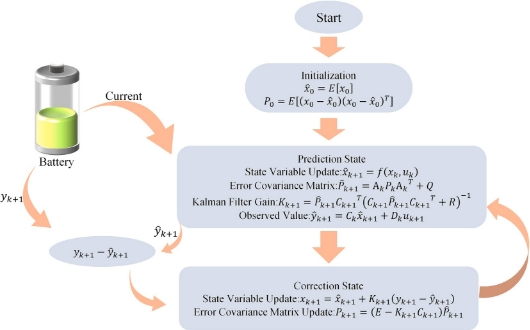
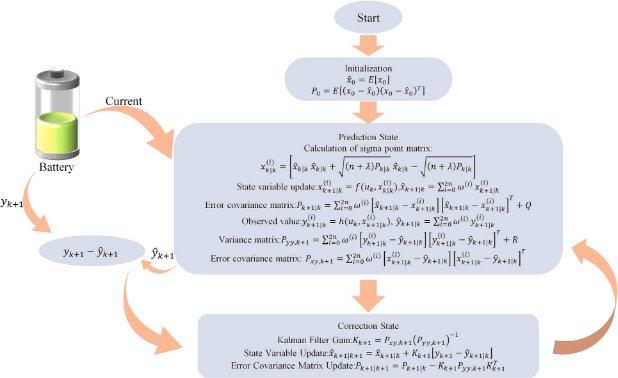

[Journal of Energy Storage 110 (2025) 115346](https://doi.org/10.1016/j.est.2025.115346)

Review Article

A review of battery SOC estimation based on equivalent circuit models

Chao Wang [a](#_bookmark0), Mingjian Yang [a](#_bookmark0), Xin Wang [a](#_bookmark0), Zhuohang Xiong [a](#_bookmark0), Feng Qian [a](#_bookmark0),[*](#_bookmark4), Chengji Deng [b](#_bookmark1),

Chao Yu [b](#_bookmark1), Zunhua Zhang [c](#_bookmark2), Xiaofeng Guo [d](#_bookmark3),[*](#_bookmark4)

a *School of Automobile and Traffic Engineering, Hubei Provincial Engineering Research Center of Advanced Chassis Technology for New Energy Vehicles, Wuhan Scientific and Technological Achievements Transformation Pilot Platform (Base) of Automotive Intelligent Sensor, Wuhan University of Science and Technology, Wuhan,*

*Hubei 430065, PR China*

b *The State Key Laboratory of Refractories and Metallurgy, Wuhan University of Science and Technology, Wuhan, Hubei 430081, PR China*

c *School of Naval Architecture, Ocean and Energy Power Engineering, Wuhan University of Technology, Wuhan, Hubei 430063, PR China*

d *Universit*´*e Paris Cit*´*e, CNRS, LIED UMR 8236, Paris F-75006, France*

![ref1]

A R T I C L E I N F O 

*Keywords:*

SOC

Equivalent circuit model Estimation methods Parameter identification Kalman filtering

A B S T R A C T 

Hiệu suất và an toàn của xe điện phụ thuộc nhiều vào trạng thái pin; do đó, việc dự đoán chính xác trạng thái sạc (SOC) trong các hệ thống quản lý pin (BMS) là rất quan trọng. Do các đặc tính phức tạp của pin lithium-ion, SOC không thể được đo trực tiếp, khiến việc ước lượng chính xác trở nên cần thiết để nâng cao hiệu suất và tuổi thọ của pin. Bài tổng quan này tóm tắt những tiến bộ gần đây trong các kỹ thuật ước lượng SOC dựa trên mô hình mạch tương đương (ECM) và phác thảo các hướng phát triển trong tương lai. Ước lượng SOC dựa trên ECM mang lại những lợi thế như sự đơn giản, khả năng áp dụng mạnh mẽ, giám sát theo thời gian thực, độ bền và phản hồi nhanh. Các phát triển trong tương lai sẽ tập trung vào việc cải thiện độ chính xác của mô hình, tích hợp nhiều mô hình và kết hợp các thuật toán trí tuệ nhân tạo, bao gồm mạng nơ-ron và học sâu. Khi các công nghệ mạng và thông minh phát triển, việc ước lượng SOC sẽ trở nên tích hợp và tự động hóa hơn, cho phép BMS dự đoán SOC một cách chính xác hơn thông qua phân tích dữ liệu đám mây và học máy, từ đó thúc đẩy công nghệ pin xe điện.

![ref1]

1. # **Introduction**

Giảm phát thải khí nhà kính và cải thiện hiệu quả năng lượng là rất quan trọng để đạt được chuyển đổi năng lượng và phát triển bền vững [1]. Xe điện (EV) đã thu hút sự chú ý và được thúc đẩy ngày càng nhiều như là công cụ vận chuyển năng lượng sạch [2]. Pin, phục vụ như là các đơn vị lưu trữ năng lượng cho xe điện, ảnh hưởng trực tiếp đến phạm vi hoạt động, hiệu suất và độ an toàn của xe. Tình trạng của pin được theo dõi bởi Hệ thống Quản lý Pin (BMS) [3] trong suốt quá trình hoạt động hàng ngày. Dự đoán Trạng thái Nạp (SOC) của pin trong BMS là một nhiệm vụ quan trọng, vì SOC phản ánh khả năng phạm vi hoặc thời gian sử dụng còn lại của pin. Cấu trúc phức tạp và các quá trình điện hóa của pin lithium, bao gồm việc SOC không thể được đo trực tiếp, nhấn mạnh tầm quan trọng của việc ước lượng chính xác SOC để nâng cao hiệu suất pin lithium và kéo dài tuổi thọ của pin [4].

[Fig. 1](#_bookmark5) shows the classification of common SOC estimation methods into the open-circuit voltage (OCV) method [[5–7](#_bookmark27)], ampere-hour (Ah) integration method [[5](#_bookmark27),[7–9](#_bookmark29)], data-driven methods [[7](#_bookmark29)], and model-based

methods [[5](#_bookmark27),[7](#_bookmark29),[10](#_bookmark31)]. The open-circuit voltage (OCV) method [[6](#_bookmark28)] involves completely putting the battery in a static state, using the static open- circuit voltage of the battery, building an OCV-SOC curve, and then establishing a table lookup method to estimate the SOC of the battery. While this method is relatively simple and eliminates the need for complex modeling calculations, it heavily relies on highly precise in- struments and prolonged static conditions, which limit its feasibility for online implementation [[11](#_bookmark32)]. Additionally, factors such as temperature and aging can affect the accuracy of SOC estimation. The ampere-hour integration method, also known as the Coulomb counting method, is a classic approach that starts from the definition of the SOC of a battery and calculates the SOC as the integral of the current over time [[5](#_bookmark27)]. This method is straightforward and easy to implement, but errors in current measurement can accumulate over time, leading to increasing cumula- tive errors. Moreover, the method heavily depends on the accuracy of the initial SOC value, rendering the measurement meaningless if the initial value is inaccurate [[8](#_bookmark30)]. Data-driven methods effectively address nonlinear problems, offering high estimation accuracy. However, the method requires establishing relationships between variables based on

\* Corresponding authors.

*E-mail address: <feng.qian@wust.edu.cn>* (F. Qian).

<https://doi.org/10.1016/j.est.2025.115346>

Received 22 July 2024; Received in revised form 2 December 2024; Accepted 4 January 2025

Available online 9 January 2025

2352-152X/© 2025 Elsevier Ltd. All rights are reserved, including those for text and data mining, AI training, and similar technologies.

![ref2]![ref3]

**Fig. 1.** Common SOC estimation methods.

extensive experimental data [[12](#_bookmark33)], and it heavily relies on historical data. If the data fails to reflect the battery’s characteristics, significant errors in SOC estimation may occur [[13](#_bookmark34)], rendering the method not applicable in practice. Model-based methods encompass electrochemical models (EM) and equivalent circuit models (ECM) [[14](#_bookmark35),[15](#_bookmark36)]. Electrochemical modeling (EM) is achieved by analyzing the reaction mechanisms within the cell and establishing partial differential equations for the electrode and electrolyte dynamics. Common electrochemical models (EM) include one-dimensional (1D) models [[16](#_bookmark37),[17](#_bookmark38)] and pseudo-two- dimensional (P2D) models [[18–21](#_bookmark39)], and the P2D model is shown in [Fig. 2](#_bookmark6). Although these models accurately describe battery internal chemical reactions, their complexity may exceed practical system computational capabilities, making it challenging to apply them to BMS. Equivalent circuit models (ECM) [[15](#_bookmark36)] simulate the battery’s dynamic voltage response characteristics by composing circuit networks using circuit elements such as capacitors, resistors, and constant voltage sources. Equivalent circuit models are most commonly used in BMS research. While simple equivalent circuit models reduce the computa- tion complexity of SOC estimation, their precision is low. Complex equivalent circuit models can accurately reflect battery output charac- teristics but increase computational efforts and memory consumption,

**Fig. 2.** The P2D model.

leading to suboptimal real-time application performance [[22](#_bookmark41)]. There- fore, how to balance the accuracy of the model with the order is an important issue in current research.

For an extended period, researchers have been developing a method for SOC estimation that is computationally efficient, offers high accu- racy, and demonstrates robust performance. While SOC estimation methods based on equivalent circuit models have garnered attention due to their intuitiveness and ease of implementation, comprehensive re- view studies on these methods remain relatively scarce. Unlike other reviews, this paper aims to provide a thorough examination of the latest advancements in SOC estimation methods utilizing battery equivalent circuit models. By summarizing existing SOC estimation techniques, researchers are exploring various algorithms and optimization strategies to enhance estimation accuracy. For instance, the integration of deep learning techniques facilitates end-to-end SOC estimation. Furthermore, data-driven approaches, such as neural networks, have also been widely employed in SOC estimation. However, significant research is still required to effectively apply equivalent circuit model-based SOC esti- mation methods in real-world scenarios. This review will offer a comprehensive perspective on the recent developments in SOC estima- tion methods based on equivalent circuit models, covering the applica- tion of various algorithms, model optimization, and future research directions. Through these investigations, we anticipate achieving more accurate and reliable SOC estimation technologies in practical applica- tions, thereby enhancing battery efficiency and safety.

The structure of the remainder of this review is as follows: Chapter

Two provides a detailed overview of five common equivalent circuit models, comparing their accuracy, applicability, and computational complexity. Chapter Three discusses parameter identification and various SOC estimation methods, including Kalman filtering, sliding mode observers, H∞ filtering, and composite algorithms, evaluating their performance and suitability under different operating conditions. Chapter Four explores key factors affecting SOC estimation accuracy, such as temperature, battery aging, and self-discharge, summarizing current strategies to address these issues. Chapter Five concludes with an overview of the challenges faced by current SOC estimation tech- nologies in real vehicle applications and outlines potential future trends in SOC estimation development.

1. # **Equivalent circuit model (ECM)**

The equivalent circuit model utilizes traditional circuit elements such as resistors, capacitors, and constant voltage sources to form a circuit network that describes the external characteristics of the power battery [[23](#_bookmark42)]. This model employs voltage sources to represent the thermodynamic equilibrium electromotive force of the power battery and utilizes an RC network to describe various operational states of the power battery, exhibiting good applicability. Furthermore, the model can derive state equations for ease of analysis and application. The equivalent circuit model has been widely applied in modeling and simulation studies of new energy vehicles and model-based BMS. Key models include the Rint model, the Thevenin model, the PNGV model, the GNL model, and the Dual Polarization (DP) model [[24](#_bookmark43),[25](#_bookmark44)]. The structures of these models and their corresponding state equations are presented in [Table 1](#_bookmark7).

1. *Rint model*

The Rint model consists of only an ideal voltage source and an in- ternal resistance [[26](#_bookmark45)], which is simple to construct due to its constant internal resistance value, thus facilitating straightforward calculations. The Rint model is considered the simplest equivalent circuit model [[27](#_bookmark46)] suitable for ideal states with few dynamic parameters. However, due to the lack of consideration for polarization characteristics, the Rint model may exhibit substantial deviations between simulated results and actual measurements under high-rate charge and discharge conditions.

**Table 1**

![ref4]Comparison of equivalent circuit models.

Model	Modeling structure	State equation	Advantage	Disadvantages

![ref4]

Rint	*UL* = *UOC* — *ILR*0	• Simple structure	• Low accuracy and poor applicability

Thevenin	⎨ <i>UL</i>	= <i>UOC</i> — <i>ILR</i>0 — <i>U</i>1

- Simple structure considering the
- Limitations in the

	 

⎪⎩ *dt*	= *C*1 — *R*1 *C*1

PNGV	⎧⎪ <i>UL</i>	= <i>UOC</i> — <i>ILR</i>0 — <i>U</i>1 — <i>Ub</i>



battery

- Consider the dynamics of the battery



characteristics of batteries

- Complex model structure,

⎪⎨⎪ *dU*1

 *IL*

 *U*1 

and be able to simulate the

high computational cost,

<i>dUb</i>

 *IL*

voltage as the current accumulates

⎪⎩ <i>dt</i>	= <i>Cb</i>

GNL	⎧⎪ <i>UL</i>	= <i>UOC</i> — <i>ILR</i>0 — <i>U</i>1 — <i>U</i>2 — <i>Ub</i>



- Considering self-discharge, the model



- Complex model structure,

*dU*1

⎪

 *IL*

 *UOC*

 <i>Ub</i> 

 *U*1 

 *U*2 

 *U*1 

is highly accurate and can accurately

many parameters, poor

![ref5]![ref5]![ref5]⎪⎨ *dt*	= *C* + *R C* — *R C* — *R C* — *R C* — *R C*	simulate the dynamic characteristics of	applicability

![ref6]![ref6]![ref6]![ref6]![ref6]![ref7]![ref7]*dt*	= *C*2 + *RSC*2 — *RSC*2 — *RSC*2 — *RSC*2 — *R*2 *C*2

Moreover, the Rint model is unable to accurately depict the dynamic characteristics of the battery under various operating conditions [[21](#_bookmark40)]. Given the intricate chemical reactions within lithium-ion batteries, the ohmic internal resistance and open-circuit voltage of the battery continuously change. Since the Rint model considers only the static characteristics of the battery and overlooks the polarization effects caused by environmental factors, particularly in cases of battery aging or significant temperature variations, the model’s accuracy is limited and not suitable for practical applications.

1. *Thevenin model*

Compared with the Rint model, an RC circuit [[28](#_bookmark47)] is incorporated into the Thevenin model to simulate the battery’s polarization charac- teristics, effectively capturing the dynamic aspects of the lithium battery charging and discharging processes [[29](#_bookmark48)]. This integration allows for simple model parameter identification. The Thevenin model can char- acterize the dynamic response of the battery, where *R*0 represents the instantaneous voltage response during battery charging and discharging moments, while the RC circuit can reflect the phenomenon of gradual change of the battery voltage during and after the end of charging and discharging.

To enhance model accuracy, Zhao et al. [[30](#_bookmark49)] proposed an improved Thevenin model introducing a novel Dual Polarization Resistance (DPR), which adjusts the polarization resistance adaptively based on load current, thereby increasing model robustness. Considering the significant impact of temperature on the charging and discharging performance of batteries, Wu et al. [[31](#_bookmark50)] established a temperature-

compensation model based on the traditional Thevenin model and identified the battery parameters across a temperature range of 0 ◦C to 40 ◦C, and experimentally verified that good SOC estimation accuracy is

achieved within this temperature range. Zhang et al. [[32](#_bookmark51)] introduced a variable-order Thevenin model that uses mean squared error (MSE) to dynamically determine the battery’s order. He et al. [[33](#_bookmark52)] proposed an equivalent hysteresis model with parameters that vary with SOC and temperature, which, compared to traditional fixed-parameter Thevenin models, more accurately reflects the battery’s dynamic characteristics. Qi et al. [[34](#_bookmark53)] have developed an improved Thevenin model that con- siders internal polarization reactions and open-circuit voltage hysteresis effects, thereby improving the physical significance of parameter iden- tification results. This advancement allows for a better approximation of the highly nonlinear characteristics of lithium batteries.

1. *PNGV model*

The Partnership for a New Generation of Vehicles (PNGV) model

[[27](#_bookmark46)] is based on Thevenin’s model, where a capacitor is connected in series with Thevenin’s model, incorporating a capacitor in series to represent the changes in open-circuit voltage induced by load currents, thus simulating the variation of lithium battery open-circuit voltage with accumulating current effects [[35](#_bookmark54)]. Precisely because it can simulate the changes in OCV with accumulating current effects, the PNGV model is only suitable for simulating single HPPC or equal amplitude positive and negative pulses and is not suitable for other current pulses, which is a major drawback of the PNGV model [[36](#_bookmark55)].

The size of the capacitance *C*b in the PNGV model not only charac- terizes the battery’s capacity but also represents the battery’s DC response, addressing the limitations of the traditional Thevenin model [[37](#_bookmark56)]. To enhance the curve fitting accuracy of the PNGV model, a set of additional RC networks was incorporated to represent the polarization effects of the battery, aligning the model more closely with the internal structure and dynamic effects of the battery [[38–40](#_bookmark57)]. Geng et al. [[40](#_bookmark58)]

proposed an improved PNGV model that accounts for the impact of SOC variations on parameters based on a second-order PNGV model. This model has been validated in the laboratory, demonstrating its applica- bility across different filtering algorithms and confirming its generality in SOC estimation. However, the experiment was conducted under room

temperature conditions of 25 ◦C, which does not fully account for the

complex and variable operational environments of electric vehicles. Fluctuations in ambient temperature could potentially influence battery performance and parameters, a factor that was not adequately addressed in the study. Jiang et al. [[41](#_bookmark59)] improved the PNGV model based on the fractional order theory, which accurately describes the dynamic phe- nomena inside the cell and improves the accuracy of the model. How- ever, the study did not take into account the effects of temperature variations on battery parameters and the order of the fractional expo- nent. While fractional-order models offer mathematically higher flexi- bility, their physical interpretation may not be as intuitive as that of integer-order models, potentially impacting their application in engi- neering contexts. Liu et al. [[42](#_bookmark60)] considered charging and discharging discrepancies and replaced the ohmic internal resistance in the tradi- tional PNGV model with a parallel network of diode resistances. Addi- tionally, Liu added an RC network to represent the dynamic and static characteristics of the battery, demonstrating through experiments that the model effectively reflects the battery’s operational characteristics. However, the study did not consider the effects of temperature varia- tions and the impact of battery aging.

1. *GNL model*

The GNL model [[43](#_bookmark61)], proposed by the State Key Laboratory of Automotive Safety and Energy at Tsinghua University, is an improve- ment upon the PNGV model. It takes into account the impact of self- discharge factors on the battery, allowing for the simulation of phe- nomena such as lithium battery electrochemical polarization, concen- tration polarization, and self-discharge [[44](#_bookmark62)]. This model more accurately restores the true state of lithium batteries compared to pre- vious models. However, the GNL model involves a larger number of parameters, making parameter identification more challenging and increasing computational complexity [[45](#_bookmark63),[46](#_bookmark64)], hence limiting its appli- cability in the field of SOC estimation for lithium batteries.

The GNL model integrates the advantages of the Rint, Thevenin, PNGV, and DP models, enabling the accurate simulation of battery characteristics. However, the increased complexity of the estimation process leads to computational challenges and limits practical applica- tions [[47](#_bookmark65)]. Li et al. [[48](#_bookmark66)] recognized the high complexity of the GNL model, which hinders engineering implementation, and simplified the self-discharge coefficient based on the GNL model to reduce its complexity. The authors have compared the parameter identification results of the simplified GNL model with those of the DP model. Although the parameter identification results of the two models are essentially equivalent, the DP model is simpler than the simplified GNL model in dealing with third-order equations. Yan et al. [[45](#_bookmark63)] simplified the GNL model by using OCV-SOC curves to represent the impact of SOC variations on open-circuit voltage, instead of adding capacitance as in the PNGV model. By formulating a matrix secondary discrete state-space equation and utilizing adaptive Unscented Kalman Filtering for SOC estimation, experimental results demonstrated that this approach yiel- ded minimal estimation errors and fast-tracking characteristics in aging battery SOC estimation, meeting practical requirements. Gao et al. [[49](#_bookmark67)] considered the minimal performance impact of overcharging and self- discharge on batteries and simplified the GNL model by reducing a set of RC networks in the circuit, significantly simplifying the model complexity and enhancing real-time performance and efficiency.

1. *Dual-polarization (DP) model*

The DP model is based on Thevenin’s model with an RC circuit

connected in series, which not only reflects battery polarization phe- nomena but also simulates surface effects on the battery [[25](#_bookmark44),[50](#_bookmark68)]. In most models, as the order of the RC model increases, the accuracy of the model improves. However, with a higher model order, the complexity of system parameter identification calculations also increases [[51](#_bookmark69)]. The DP model exhibits high accuracy and can accurately reflect the internal parameters of the battery. By utilizing the publicly available INR 18650- 20R battery dataset from the Advanced Life Cycle Engineering Center (CALCE) at the University of Maryland [[52](#_bookmark70)], and applying the Particle Swarm Optimization (PSO) algorithm, we compared the terminal voltage and simulated terminal voltage, along with error analysis, for the Thevenin, PNGV, and DP models under three different operating conditions: DST, HPPC, and FUDS, as shown in [Fig. 3](#_bookmark8). The results indicate that, under these varying conditions, the DP model outperforms both the Thevenin and PNGV models in terms of accuracy and dynamic performance.

Zhou et al. [[53](#_bookmark71)] developed an equivalent circuit model that considers battery hysteresis characteristics, using dynamically selected hysteresis small loop SOC-OCV curves for estimation filtering to reduce OCV errors during battery charge and discharge processes. However, the parameter selection within the hysteresis characteristic model was not rigorously derived from theoretical analysis; instead, it was determined through a segmented testing method to ascertain suitable parameter values within different SOC ranges. This approach may not ensure optimal parameter settings under all operating conditions. Furthermore, the refined model does not account for the hysteresis characteristics of batteries under varying temperature environments and states of aging. By considering the impact of temperature variations on battery parameters, a temperature-dependent DP model can be developed [[54](#_bookmark72),[55](#_bookmark73)]. Consid- ering that adding RC networks can enhance model accuracy, Che et al.

[[56](#_bookmark74)] proposed a third-order RC model, which, although increasing ac- curacy, also leads to heightened complexity and computational chal- lenges. To overcome the issues of low accuracy in low-order models, increased complexity in high-order models, and increased computa- tional burden, Ji et al. [[57](#_bookmark75)] used a second-order RC model with variable resistance and capacitance. This method diverges from the offline models that employ fixed resistors and capacitors by simulating with variable resistors and capacitors. The online model is capable of updating parameters in real time according to the battery’s instanta- neous state. Experimental validation has confirmed that the accuracy of the variable resistor-capacitor model has achieved a precision of 2.9 %, enhancing the model’s adaptability and precision. However, models with variable parameters may be sensitive to the initial values of certain parameters, necessitating precise initial parameter estimation to ensure the accuracy of the model. He et al. [[58](#_bookmark76)] proposed an enhanced DP equivalent circuit model by incorporating a state capture noise variation to better handle bias noise from battery sensors in practical electric vehicles. Although the refined model accounts for sensor noise, the precision limitations of sensors remain a significant challenge in prac- tical applications.

Among the five equivalent circuit models, the DP model exhibits superior capabilities in simulating various performance aspects of lithium batteries, demonstrating high accuracy. Furthermore, the bal- ance of computational demands associated with the DP model has facilitated its widespread application in the current research landscape of SOC estimation for lithium-ion batteries. Researchers are striving to enhance both the precision and applicability of the model while aiming to reduce computational costs. Notably, the model’s adaptability and robustness under practical operating conditions, such as aging and temperature fluctuations, have emerged as pivotal areas for future research. Additionally, with the continuous advancements in machine learning technologies, data-driven approaches based on the DP model are expected to play an increasingly critical role in future battery ma- terial design and technological development.

**Fig. 3.** Comparison of Thevenin, PNGV, and DP model measured end-voltages with analogue end-voltages and error comparison. (a) and (b) under the DST test; (c) and (d) under the HPPC test; (e) and (f) under the FUDS test.

1. # **Parameter identification and state estimation**

SOC Estimation Based on Equivalent Circuit Models includes two main components: parameter identification of the equivalent circuit model and state estimation of the battery. Initially, it is necessary to perform parameter identification on the established model. Subse- quently, model validation is conducted, as the accuracy of the model is essential for precise estimation of the battery’s SOC. Finally, the design

and validation of SOC estimation algorithms are carried out based on the established model’s state and observation equations, as shown in [Fig. 4](#_bookmark9).

1. *Parameter identification of equivalent circuit models*

Since the lithium-ion battery is a complex, time-varying, nonlinear system, there are complex chemical and physical changes inside the battery, and the internal parameters of the battery vary with

**Fig. 4.** SOC estimation process.

temperature, the number of charge-discharge cycles, and the degree of battery aging [[59](#_bookmark77)]. Therefore, before estimating the SOC of lithium batteries, it is important to validate the accuracy of the constructed model and precisely identify the parameters of the equivalent circuit model [[60](#_bookmark78)]. Parameter identification of the equivalent circuit model involves extracting relevant segments from original experimental data and using data processing techniques to establish the relationship be- tween the model’s internal parameters and the battery SOC, thereby completing the model’s construction. Since internal battery parameters cannot be directly obtained through experiments, they are derived from external characteristics of lithium batteries such as voltage, current, and temperature. Parameter identification is categorized into offline iden- tification and online identification [[59](#_bookmark77),[61](#_bookmark79)].

Offline identification refers to utilizing pre-existing offline parameter tables, which the method does not require recalculating model param- eters, offering a straightforward and convenient operation. However, as the environment changes and the number of charge cycles increases, internal battery parameters fluctuate, gradually reducing the model’s accuracy. The principle behind offline parameter identification methods lies in conducting HPPC experiments to identify parameters such as open-circuit voltage, internal resistance, polarization resistance, and hysteresis voltage, among others, through offline identification. By fitting or interpolating the relationships between these parameters and SOC, the offline parameter values of the battery under all SOC condi- tions are obtained [[62](#_bookmark80)]. Common offline parameter identification methods include curve fitting, and the least squares method [[63](#_bookmark81)]. Online parameter identification involves utilizing real-time measurements of current, voltage, temperature, and other data from lithium-ion batteries to identify parameters and achieve real-time updates of model param- eters. However, this method entails high computational requirements and costs. Common online identification methods include Recursive Least Squares (RLS), Extended Kalman Filter (EKF), Genetic Algorithm (GA), and Particle Swarm Optimization (PSO) [[63](#_bookmark81)], among others.

In offline parameter identification, the curve fitting method is widely

used to identify the parameters of batteries. The curve fitting method obtains model parameters by fitting a function to the entire experi- mental charge/discharge curve. The transient response of the terminal voltage is plotted using the INR 18650-20R battery dataset from the publicly available network database of the Advanced Lifecycle Engi- neering Center (CALCE) at the University of Maryland [[52](#_bookmark70)] (as shown in [Fig. 5](#_bookmark11)). The variation of the terminal voltage during the hysteresis period is expressed by Eq. [(1)](#_bookmark10).

<i>Ub</i> = <i>k</i>0 — <i>k</i>1<i>e</i>—<i>λ</i>1 <i>t</i> — <i>k</i>2<i>e</i>—<i>λ</i>2 <i>t</i>	(1)

Taking the DP model as an example, the terminal voltage is expressed as:

` `*t	t*

<i>Ub</i> = <i>Uoc</i> — <i>R</i>0<i>IL</i> — <i>R</i>1<i>e</i>—<i>τ</i>1 — <i>R</i>2<i>e</i>—<i>τ</i>2	(2)



**Fig. 5.** Terminal voltage transient response.

where *τ*1 = *R*1*C*1 and *τ*2 = *R*2*C*2, the parameters *R*1, *R*2, *C*1, and *C*2 can be obtained according to Eqs. [(1) and (2)](#_bookmark10). Since the step change in the terminal voltage at the instant of current disappearance is consistent

with the purely resistive characteristic, we can attribute the voltage drop at this point to the ohmic internal resistance:

<i>R</i>0 = △<i>U</i>/<i>IL</i>	(3)

where ΔU represents the step change in terminal voltage at the instant of discharge cessation. This method provides higher accuracy than feature extraction methods and only requires specifying the functional expres- sion of the parameters to calculate the corresponding values. This method offers high precision, but the identified parameters remain constant [[61](#_bookmark79)].

The least squares method (LS) [[64](#_bookmark82)] and its improved methods are widely used in equivalent circuit parameter identification. The least squares method is a classical data processing method and is one of the most basic methods in the field of system identification. In lithium-ion power battery parameter identification, the least squares method can be used for both static and dynamic systems and can be applied to linear and nonlinear systems, which are widely used in the battery field. The Recursive Least Squares (RLS) method, a derivative of the least squares method, is commonly used for model parameter identification. When system and model parameters are significantly influenced by environ- mental factors, RLS effectively overcomes uncertainties in model pa- rameters  through  parameter  correction  and  updates,  accurately

reflecting the real-time state of the system. Ren et al. [[65](#_bookmark83)] have proposed an improved RLS method, which incorporates an inner loop that itera- tively updates the estimation parameters. This approach enables rapid and accurate identification of model parameters during the charge- discharge process. However, introducing an additional parameter that dictates the number of iterations within the inner loop increases the computational load and requires additional tuning and testing to determine the optimal number of iterations. The traditional RLS algo- rithm as the recursive algorithm continues to run, data saturation may occur, affecting the precision of the algorithm. To address this issue, a forgetting factor is introduced based on the Recursive Least Squares method to adjust the ratio between old and new data, enhancing the estimation accuracy of the algorithm [[66–68](#_bookmark84)]. When faced with complex and frequently changing current excitations, the convergence and ac- curacy of the Forgetting Factor Recursive Least Squares (FFRLS) method in parameter identification may be compromised. To tackle this chal- lenge, Liu et al. [[69](#_bookmark85)] introduced a Recursive Gradient Correction strat- egy (RGC) on top of FFRLS. However, the modified algorithm involves parameters such as the forgetting factor, model accuracy threshold, and the weight matrix of the RGC, the selection and adjustment of which can significantly influence the performance of the algorithm. To further enhance identification accuracy, adaptive adjustments of data weights can be made through dynamic forgetting factor adaptation in the Vari- able Forgetting Factor Recursive Least Squares method [[70](#_bookmark86),[71](#_bookmark87)]. Recognizing the difficulty of balancing the accuracy, convergence, and stability of multiple parameters with varying cycles in the FFRLS algo- rithm, a study proposed an Adaptive Recursive Least Squares method. By utilizing multiple forgetting factors, online identification of battery model parameters is achieved, adapting to the changing characteristics of battery parameters over time and under varying operating conditions [[72](#_bookmark88),[73](#_bookmark89)]. Shi et al. [[74](#_bookmark90)] used an Adaptive Forgetting Factor Bias Compensation Recursive Least Squares method to identify battery model

parameters, enhancing dynamic identification capabilities and effec- tively compensating for noise effects. Further research and improvement of the adaptive forgetting factor and bias compensation strategy, considering factors such as battery aging, could enhance parameter identification accuracy. The identification process of the Adaptive Forgetting Factor Recursive Least Squares (AFFRLS) is illustrated in [Fig. 6](#_bookmark12).

In addition to the most commonly used least squares method and its improved algorithms, genetic algorithms (GA) [[63](#_bookmark81)], particle swarm optimization (PSO) [[75](#_bookmark91)], and Kalman filter (KF) [[64](#_bookmark82)] have also been applied in battery parameter identification. Due to inappropriate initial values chosen during the iterative process in the least squares method, data fitting errors are likely to occur, potentially leading to local optima or failure to converge. Sun et al. [[76](#_bookmark92)] employed the genetic algorithm (GA) for parameter identification to obtain the initial values, followed by the use of forgetting factor recursive least squares (FFRLS) for final identification. However, the choice of forgetting factor significantly af- fects algorithm performance, making the exploration of adaptive GA- FFRLS forgetting factor adjustment methods to accommodate dynamic battery parameter changes especially important. Zhang et al. [[77](#_bookmark93)] employed the improved ant lion optimization algorithm (IALO) for battery parameter identification. However, compared to traditional parameter identification methods, IALO, before a nature-inspired algo- rithm, introduces a higher level of computational complexity. The parameter identification process requires more time to converge to the optimal solution, and combining IALO with other optimization algo- rithms to form hybrid optimization strategies could improve the robustness and search efficiency of the algorithm. Xu et al. [[78](#_bookmark94)] utilized a particle filter (PF) for online battery parameter identification. Within the PF framework, the parameter vector of the battery model is treated as the state vector and is updated through a state-space model. However, the application of PF may encounter the issue of particle degeneracy,

**Fig. 6.** Flowchart of parameter identification of AFFRLS algorithm.

which can diminish the accuracy of the estimation. Additionally, the performance of the PF heavily depends on the selection of key param- eters, such as the number of particles and noise covariance. Improper parameter selection can adversely affect the performance of the filter.

**Table 2**

EKF algorithm and its improvements.

Author	Algorithm	Model	Description	Technical

![ref8]challenges

Loukil et al. [[79](#_bookmark95)] proposed an online internal parameter estimation method based on recursive least squares (RLS), adaptive joint extended Kalman filter (AJEKF), and unscented Kalman filter (UKF). These methods aim to identify the parameters of the battery model by mini- mizing the sum of squared errors and updating the process and mea- surement noise statistical properties in real time through adaptive mechanisms. However, these methods are highly sensitive to noise and require the design of more robust noise models or adaptive filters to automatically adjust noise parameters.

Despite significant progress in parameter identification methods for battery SOC estimation, considerable challenges remain. Future research will focus on developing more robust and efficient parameter identification methods, such as particle swarm optimization algorithms based on information feedback and variational fuzzy recursive least squares methods based on wavelet transforms. Furthermore, deep learning-based battery parameter identification methods, such as con-

Fu et al. [[104](#_bookmark117)]

Yang et al. [[105](#_bookmark118)]

AIEKF	DP +

FFRLS

MEKF	DP +

DBOFT

Introduce adaptive updates to handle the uncertain noise of lithium-ion batteries, and use iteration to improve convergence speed and reduce computational burden.

Combine the gain matrix and noise adjustment to reduce voltage estimation errors at points of current variation.

Did not consider the effects of aging and other factors, and employed a specific statistical model for handling noise.

Did not consider the effects of aging and other factors.

volutional neural networks (CNNs) or recurrent neural networks

(RNNs), are also worthy of further investigation, as they can learn the relationships between battery parameters and performance directly from charge and discharge data. These methods have the potential to provide more accurate parameter estimates and reduce reliance on traditional algorithms.

1. *State estimation*

The SOC of a lithium-ion battery is primarily used to represent the remaining battery energy, defined as the ratio of the remaining battery capacity to the rated capacity [[80](#_bookmark96)], commonly expressed as a percent- age. The specific calculation expression is:

SOC = (<i>Qt</i>/<i>Q</i>0) × 100%	(4)

Zhang et al. [[106](#_bookmark119)]

DEKF	Thevenin	Establish a parameter database for noise characteristics to improve the accuracy of state estimation, without relying on temperature as an input, thus avoiding issues related to inaccurate temperature measurements and limited temperature measurement points.

The noise characteristics can change over time and with operating conditions.

where *Q*t represents the remaining capacity of the battery at time t, and *Q*0 represents the rated capacity of the battery. Currently, the main methods for SOC estimation based on the equivalent circuit model are those based on filters and observers. Filter algorithms primarily include Kalman filters, particle filters, etc. As shown in [Table 2](#_bookmark13) Kalman filter algorithms mainly include extended Kalman filter (EKF), unscented Kalman filter (UKF), and cubature Kalman filter (CKF).

Maheshwari et al. [[107](#_bookmark120)]

SFO-EKF	DP +

VFFRLS

By optimizing the noise covariance matrices Q and R in the EKF using the Sunflower Optimization Algorithm (SFO), the accuracy of SOC estimation is improved.

Increased the complexity of the computation.

1. *Kalman filter (KF)*

The Kalman filter algorithm [[81](#_bookmark97)] (KF) is a filtering theory established based on the state space theory in the time domain, which regards the signal to be estimated as the output of a linear stochastic system with white noise superimposed, with both state and observation equations formulated in the time domain. In the field of SOC estimation, the basic idea of the Kalman filter algorithm is to construct a set of state space equations describing the characteristics of the battery system first, with SOC as an internal state. Then, based on the prediction result of the previous step and the current measurement data, the optimal processing obtains the best SOC output result.

When using the Kalman filter to estimate SOC, the accuracy of the Kalman filter is related to the accuracy of the equivalent circuit model. The traditional Kalman filter algorithm is applicable to linear systems [[82](#_bookmark98)]. When the system under consideration is a nonlinear battery sys- tem, linearization of the system is necessary. The Kalman filtering al-

Liu et al. [[108](#_bookmark121)]

VCEKF- BP

DP +

FFRLS

Combining EKF, variance compensation algorithm, and BP neural network. The variance compensation algorithm updates the process noise covariance of the EKF algorithm in real time, while the BP neural network simultaneously provides compensation values to obtain the final estimated SOC.

Requires a large amount of data for neural network training.

gorithm measures the dynamic SOC, constantly corrects the current

estimate using Kalman gain, and quickly tracks the true value of SOC during continuous iterations to achieve the optimal estimate in terms of minimum mean square error. This algorithm is known for its fast

Yu et al. [[109](#_bookmark122)]

EKF- LSTM

DP + LS	Use the EKF

algorithm to obtain an initial SOC estimate, and then utilize the

The LSTM

network may experience overfitting

convergence speed and high estimation accuracy, but it requires a high

degree of model accuracy which can be a drawback. The basic principles

(*continued on next page*)

![ref8]**Table 2** (*continued* )

Author	Algorithm	Model	Description	Technical

![ref8]challenges

Kalman filter with a linear model to estimate SOC, employing Partial Least Squares (PLS) and a moving window method to obtain linear segments of the battery characteristics online. Subsequently, a linear

![ref8]Kalman matrix error values, state variables, and battery data collected during system operation, updated by the EKF algorithm, as the training and testing dataset for the LSTM neural network algorithm.

of the Kalman filter algorithm [[81](#_bookmark97)] are as follows.

during the training process.

Kalman filter was utilized to estimate the SOC. The KF algorithm is only applicable to linear systems. However, due to the complex chemical interactions occurring within lithium-ion batteries, which result in solid nonlinearity and time-varying characteristics [[83](#_bookmark99)], estimating the SOC with the KF algorithm presents significant challenges. Traditional KF algorithms are unable to handle the nonlinear characteristics of lithium batteries. Therefore, the Extended Kalman Filter (EKF) has been pro- posed for use in nonlinear systems [[85](#_bookmark101)].

1. *Extended Kalman filter (EKF)*

The Extended Kalman Filter (EKF) algorithm is used for nonlinear systems, where the nonlinear system is locally linearized using a first- order Taylor expansion of the state and observation Eqs. [[86](#_bookmark102)], which is then implemented using the traditional Kalman Filter algorithm. The

The state equation and observation equation of the system are

assumed to be:

<i>xk</i>+1 = <i>f</i>(<i>xk</i>, <i>uk</i>) + <i>ωk</i>	(5)

<i>yk</i> = <i>h</i>(<i>xk</i>, <i>uk</i>) + <i>vk</i>	(6)

where *x*k represents the state variables, *u*k is the system’s input variables, *y*k is the observed variables, *ω*k is the state error, and *ʋ*k is the mea- surement error. Subsequently, the system is discretized:

EKF is an optimal estimation of the system state in the sense of minimum variance [[87](#_bookmark103)], which is based on the principle of combining a state-space model of signal and noise, using the previous estimate for recursive prediction and the current observation for corrective updating. When estimating SOC, SOC is treated as a component of the state vector, the current is used as an input parameter, and the output is the terminal voltage. The steps of the EKF algorithm are similar to those of the KF algorithm. Through a finite number of iterative operations, the EKF aims to minimize the mean square error and obtain a state estimate with the

smallest variance. This process ensures that the estimates are progres-

<i>xk</i>+1 = <i>Axk</i> + <i>Buk</i> + <i>ωk</i>

<i>yk</i> = <i>Cxk</i> + <i>Duk</i> + <i>vk</i>

(7)

sively refined to more closely approximate the true state values. The foundational principles of the EKF algorithm are further elaborated

In this equation, *x*k and *x*k+1 are the state variables of the system at time k and k + 1, respectively. *u*k is the system’s input variable, *y*k is the

observation of the system at time k, A is the state transition matrix, B is the control input matrix, C is the observation matrix, and D is the direct

below [[88](#_bookmark104),[89](#_bookmark105)].

The state equation and observation equation of the system are assumed to be as follows:

{ <i>xk</i> 1  = <i>f</i>(<i>xk</i>, <i>uk</i>) + <i>ωk</i>

transmission matrix. The Kalman filter algorithm consists of two phases

+

*y*	= *h*(*x* , *u* ) + *v*

(8)

for each iteration: the prediction phase and the update phase. The	*k*

*k  k	k*

flowchart for the traditional Kalman filter estimation of the SOC is depicted in [Fig. 7](#_bookmark14).

The KF algorithm is a well-known method for obtaining battery pa- rameters and estimating the SOC [[83](#_bookmark99)]. Meng [[84](#_bookmark100)] combined a linear

where *x*k represents the state variables, *u*k is the system’s input variable, *y*k is the observation variable, *ω*k is the state error, and *ʋ*k is the mea- surement error. Subsequently, a first-order Taylor expansion is

**Fig. 7.** Flowchart of KF algorithm for estimating SOC.

![ref2]![ref3]

performed at the point of state estimation, defining the Jacobian matrices as follows [[90](#_bookmark106)]:

[Fig. 9](#_bookmark16). Peng et al. [[99](#_bookmark112)] proposed an improved method, the Improved Adaptive Extended Kalman Filter (IAEKF), which incorporated the OCV

A<i>k</i> = (<i>∂f</i>/<i>∂x</i>) |



*x*ˆ*k* ,*uk*

, <i>Bk</i>

= (*∂f*/*∂u*)⃒⃒



*x*ˆ*k* ,*uk*

, <i>Ck</i>

= (*∂h*/*∂x*) ⃒⃒



*x*ˆ*k* +1

(9)

identified online using the FFRLS method as the observed state. Inte- grating battery capacity and SOC into a second-order filter for joint

This results in the following approximations:

{ <i>xk</i>+1  ≈ A<i>kxk</i> + [<i>f</i>(<i>xk</i>, <i>uk</i>) — A<i>k xk</i> ] + <i>ωk</i>

<i>yk</i>	≈ <i>Ckxk</i> + [<i>h</i>(̂<i>xk</i>, <i>uk</i>) — <i>Ck</i> ̂<i>xk</i> ] + <i>vk</i>



(10)

estimation reduces the filter order and increases stability. Furthermore, by establishing a polynomial relationship among OCV, SOC, and tem- perature (T), the method enhanced the algorithm’s temperature adapt-

ability. However, the performance of the method is observed to decline at 0 ◦C, indicating the need for further optimization at extremely low

where *x*k and *x*k+1 are the state variables of the system at time k and k +

1, respectively, <i>u</i>k is the system’s input variable, <i>y</i>k is the observed value of the system at time k, [<i>f</i>(<i>xk</i>, <i>uk</i>) — A<i>k xk</i> ] is equivalent to the control input term B<i>u</i>k in the Kalman Filter (KF), and [<i>h</i>(<i>xk</i>, <i>uk</i>) — <i>Ck xk</i> ] is

equivalent to the observation noise term D*u*k in the KF. Ak represents the state transition matrix, and Ck is the observation matrix. The primary distinction between the EKF algorithm and the KF algorithm lies in the use of the Taylor series for linearization of the equations. The remaining steps of the EKF algorithm are similar to those of the KF. The process of the EKF algorithm for estimating the SOC is depicted in [Fig. 8](#_bookmark15).

Kim et al. [[91](#_bookmark107)] integrated the EKF with the Smooth Variable Struc- ture Filter (SVSF) to create a dual-filter system and optimized the filter parameters using PSO for SOC estimation. This approach has demon- strated higher accuracy in the estimation of SOC and capacity compared to the traditional dual-extended Kalman Filter. However, it does not consider the temperature and aging conditions of the battery, which could lead to a degradation in estimation accuracy over time. Yun et al.

[[92](#_bookmark108)] proposed an improved method based on traditional EKF, adjusting the battery parameters in segments according to SOC variations. This method has been shown to improve the accuracy of SOC estimation. Although the segmented approach can enhance precision, determining the optimal number of segments requires experimentation and optimi- zation to balance computational cost and estimation accuracy.

However, in the EKF algorithm, the initial settings for process noise Q and measurement noise R must be accurate; otherwise, inaccurate initial values may result in non-convergence of SOC estimation [[87](#_bookmark103),[93](#_bookmark109),[94](#_bookmark110)]. To address this issue, an Adaptive Extended Kalman Filter algorithm (AEKF) [[95–98](#_bookmark111)] was proposed as an improvement on the EKF algorithm, achieving automatic noise updates to reduce estimation er- rors. The SOC estimation process of the AEKF algorithm is illustrated in

temperatures. Zhu et al. [[100](#_bookmark113)] introduced an improved AEKF algorithm

by combining the Monte Carlo method with the Adaptive Extended Kalman Filter to reduce the influence of actual noise through extensive sampling, thereby improving SOC estimation accuracy. However, this approach increases computational complexity. Additionally, a propor- tional control loop is used to reduce steady-state error, but completely eliminating steady-state error in systems with dynamic changes remains a significant challenge. [Table 2](#_bookmark13) collects the latest research reports on the EKF algorithm. Despite the widespread application of the EKF in battery SOC estimation, significant challenges remain. Future developments will focus more on enhancing the adaptability, accuracy, and compu- tational efficiency of the algorithm. Additionally, integrating data- driven approaches with advanced machine learning techniques holds promise for better addressing the complex challenges posed by battery aging and variations in external environmental conditions.

The EKF augments the traditional KF by compulsorily transforming nonlinear relationships into linear ones using a first-order Taylor expansion. This linearization process can introduce truncation errors associated with the Taylor series approximation, potentially leading to divergence in the filtering process [[101](#_bookmark114)]. The need for recalculating the Jacobian matrix at each estimation step in the EKF algorithm results in significant computational complexity. Additionally, EKF estimation re- sults are locally optimal, converging to the global optimum only under certain conditions, while the Taylor expansion process neglects higher- order terms and introduces linear errors. To address these issues, the Unscented Kalman Filter algorithm (UKF) [[102](#_bookmark115),[103](#_bookmark116)] was proposed, transforming nonlinear relationships through unscented transformation to mitigate linearization errors and potential filter divergence.

**Fig. 8.** Flowchart of EKF algorithm for estimating SOC.

![ref2]![ref3]

**Fig. 9.** Flowchart of AEKF algorithm for estimating SOC.

1. *Unscented Kalman filter (UKF)*

The Unscented Kalman Filter (UKF) is a nonlinear filtering method



*ω*(0)	=  *λ*

![ref9]*m*

proposed by S. Julier [[102](#_bookmark115)] and others. Unlike conventional methods

that linearize nonlinear functions, the UKF algorithm operates directly	*ω*(0)

within the Kalman filter framework. During the prediction process, this

algorithm employs the Unscented Transform (UT) technique to address	(*i*)⎩⎪ *ω*

*n* + *λ*

![ref9]=	+ (1 — *α*2 + *β*

= *ω*(*i*) =	，*i* = 1 ∼ 2*n*



(12)

the propagation of the mean and covariance in nonlinear systems. The UKF algorithm approximates the probability density distribution of nonlinear functions using a series of deterministic samples to approxi- mate the posterior probability density of the state, rather than approx- imating nonlinear functions. Thus, it eliminates the need for repeated Jacobian matrix calculations [[110](#_bookmark123)], significantly reducing computa- tional complexity. Importantly, the algorithm addresses the error introduced by the linearization of higher-order terms in the EKF, over- coming the low accuracy of the EKF [[111](#_bookmark124)]. The most critical aspect of the UKF algorithm is the UT transformation, which involves selecting a set of sample points from the original state distribution based on certain rules, ensuring that the mean and covariance of these sample points match those of the original state distribution. These sample points are then used to evaluate the corresponding points of the nonlinear func- tion, and the transformed mean and covariance are derived from these evaluations. The basic conversion of UT transform [[79](#_bookmark95),[112](#_bookmark125),[113](#_bookmark126)] is described below.

Assuming a nonlinear transformation *y  f(x)*, where the state vector *x* is an n-dimensional random variable with known mean *x*‾ and vari- ance *P*. Then, the UT transformation generates 2n  1 Sigma points *X*

and their corresponding weights *ω* to calculate the statistical charac- teristics of *y*.

1) Calculation 2n + 1 Sigma Points:

*m	c*	2(*n* + *λ*)

where *m* represents the mean, *c* represents the covariance, and the su- perscript denotes the index of the sample point. The scaling parameter λ = *α*2(*n* + *κ*) — n is used to reduce the total prediction error, with *λ*

controlling the distribution state of the sample points.  is a selectable

parameter, which, while not bounded, should ensure that the matrix (*n* + *λ*)*P* is a semi-positive definite matrix. The selectable parameter β ≥ 0. The accuracy of the mean and covariance after the UT trans-

formation is at least of the second order. The process flow diagram for the Unscented Kalman Filter estimation of the SOC [[113–115](#_bookmark126)] is shown in [Fig. 10](#_bookmark17).

Although the UKF algorithm is an improvement over the EKF algo- rithm, it also has some drawbacks. Firstly, when the system exhibits strong nonlinearity, the covariance update in the UKF algorithm can result in a non-positive definite matrix. To address this issue, Zhang et al.

[[116](#_bookmark127)] utilized Singular Value Decomposition (SVD) during the nonlinear transformation process of the UKF to address the potential for non- negative in the covariance matrix. Liu and Yu [[117](#_bookmark128)] addressed the possibility of non-positive definite covariance issues in the traditional UKF algorithm by employing the Square Root Unscented Kalman Filter (SR-UKF) algorithm. While these methods effectively solve the non- positive definiteness problem in the UKF, the UKF algorithm assumes

that system noise is fixed, which makes the error covariance matrix

⎪⎧ *x*(0)

(	= *x*，*i* =) 0

prone to divergence. To overcome this issue, researchers proposed the

![ref10]![ref10]⎨ <i>x</i>(<i>i</i>)	= <i>x</i> +

√̅(̅*n*̅̅̅̅+̅̅̅̅̅*λ*̅̅)̅̅*P*̅̅̅

<i>i</i>，<i>i</i> = 1 ∼ <i>n</i>

(11)

Adaptive Unscented Kalman Filter (AUKF), which adaptively adjusts by

![ref10]⎪⎩⎪ *x*(*i*)  = *x* — (√̅(̅*n*̅̅̅̅+̅̅̅̅̅*λ*̅̅)̅̅*P*̅̅̅ ) *i* ，*i* = 1 ∼ 2*n*

updating process noise covariance and measurement noise covariance during the estimation process [[118](#_bookmark129)]. To further improve accuracy, Chen

where √̅<i>P</i>̅̅) <i>T</i> √̅<i>P</i>̅̅) = <i>P</i> and √̅<i>P</i>̅̅) <i>i</i>

denote the *i* column of the matrix

et al. [[119](#_bookmark130)] proposed an improved UKF algorithm that uses an extended dimension method for adaptive modeling of model parameters, intro-

ducing an adaptive noise algorithm based on covariance matching and

1) Calculation of Weights Corresponding to the Sample Points:

**Fig. 10.** Flowchart of UKF algorithm for estimating SOC.

optimal unbiased maximum a posteriori estimation to meet the re- quirements for precise models and noise statistics in traditional UKF algorithms. However, the modified UKF algorithm still assumes that both the process noise and measurement noise are Gaussian-distributed. If the actual noise deviates from the Gaussian distribution, the perfor- mance of the algorithm’s estimation may deteriorate. In addition to using the AUKF algorithm for adaptive noise variance updating, Wu et al. [[120](#_bookmark131)] first proposed the use of the Whale Optimization Algorithm (WOA) for battery model parameter identification and adaptive adjustment of noise variance in the UKF algorithm. However, the experimental data obtained by Wu et al. were acquired under constant temperature conditions, neglecting the impact of temperature variations on battery performance, which limits the application of the algorithm across different ambient temperatures. Fu and Fu [[121](#_bookmark132)] proposed a self- calibrating SOC estimation method, which involves developing a new state-space equation based on the Thevenin model and employing the Self-Calibrating Unscented Kalman Filter (SC-UKF) algorithm for recursive SOC estimation. This method can automatically identify and calibrate unknown system errors in the state equation and reduce the impact of random noise through data fusion. However, under low- temperature conditions, the Thevenin model may introduce significant modeling errors, which require adjustment through self-calibration. Future research directions may include exploring how model parame- ters can be adaptively adjusted based on factors such as battery aging and temperature variation to further reduce system errors and improve the accuracy of SOC estimation. Although the AUKF algorithm reduces the impact of measurement noise and process noise at the cost of increased computational complexity, its accuracy is affected by real- time noise and the initial state space model. To overcome this issue, Meng et al. [[122](#_bookmark133)] proposed a battery modeling method combining the moving window method with the Least Squares Support Vector Machine (LSSVM), followed by SOC estimation using AUKF. This method enables continuous updating of new samples during battery operation, reducing the impact of internal battery characteristics changes on estimation accuracy. Although the method imposes minimal computational burden

when updating the covariance matrix, the computational load of Kalman filter-based methods remains a critical consideration in practical appli- cations. The average computation time of AUKF is longer than that of UKF, which may limit its use in real-time applications. [Table 3](#_bookmark18) collects the latest research reports on the EKF algorithm. Future research should not only improve the update methods of the state error covariance matrix to address possible filter divergence issues, but also reduce computational burden through quasi-linearization techniques. Potential future developments may include joint estimation strategies that combine adaptive filters, such as the Sage-Husa filter, with the UKF al- gorithm to dynamically update and correct the interference from un- certain noise, thereby enhancing the accuracy of online lithium-ion battery SOC estimation.

The UKF algorithm requires extensive sampling operations, resulting in high computational complexity. Additionally, in high-dimensional state spaces, it may experience divergence or decreased precision. Accordingly, Arasaratnam and Haykin [[128](#_bookmark139)] proposed the Cubature Kalman Filter (CKF) in 2009 as a solution.

1. *Cubature Kalman filter (CKF)*

The Cubature Kalman Filter (CKF) is a novel type of nonlinear filter commonly applied in high-dimensional state estimation. The core principle of the CKF algorithm is based on the Spherical Radial Cubature Rule [[128](#_bookmark139)], which resolves matrix issues in nonlinear Bayesian filters. The main difference between the CKF and UKF algorithms lies in the generation of Sigma points; the CKF requires the generation of 2n Sigma points [[58](#_bookmark76),[129](#_bookmark140)], sampling fewer points and thus being more efficient. While the UKF algorithm approximates the statistical characteristics of nonlinear equations by Taylor expansion and neglecting higher-order terms, lacking strict mathematical theory support, the CKF algorithm is grounded in numerical integration theory. It utilizes the third-order Spherical Radial Cubature Rule to approximate Gaussian integrals, providing a rigorous mathematical foundation. Furthermore, the CKF algorithm approximates the Bayesian probability distribution using a set of cubature points, ensuring that filtering weights remain positive even

**Table 3**

![ref4]UKF Algorithm and Its Improvements.

Author	Algorithm	Model	Description	Technical challenges

![ref4]Yao et al. [[123](#_bookmark134)]

FOLPF- UKF

DP + LS	Modify the UKF model using a first-order low-pass filtering (FOLPF) algorithm to improve the accuracy of battery SOC estimation.

The UKF algorithm itself may be affected by process noise and observation noise during the processing.

Wu et al. [[124](#_bookmark135)]

Hao et al. [[125](#_bookmark136)]

FOD-UKF	FOM + AGA	Considering the slow variation of battery parameters and the rapid change of

battery SOC, a joint estimation of battery parameters and SOC is implemented.

UPF	DP + IFFRLS	Using UKF as the density function for PF effectively ensures that the number of

particles does not significantly decrease, thereby improving the accuracy of the estimation results.

Did not consider the impact of temperature on the joint estimation.

In particle filtering, particle degradation remains a problem and may require regular resampling.

Lin et al. [[126](#_bookmark137)]

BPNN- UKF

DP +

AdaBoost+RLS

Use UKF for initial estimation, then learn the nonlinear relationship between the SOC estimation errors in the UKF initial estimation and the process variables using BPNN, and utilize the output of BPNN to update the state vector in the UKF estimation process in real time.

The performance of the BPNN part largely depends on the quality and quantity of the training data.

Yun et al. [[127](#_bookmark138)]

FPID-UKF	DP + FFRLS	Optimize the UKF by adjusting the Kalman gain and innovations through PID

control, and fine-tuning the PID coefficients using fuzzy control.

Computational complexity increases, and response speed is slow.

![ref4]

in high-dimensional state spaces, thus offering greater robustness and filtering accuracy compared to the UKF algorithm [[130](#_bookmark141),[131](#_bookmark142)]. The flowchart for CKF of SOC is shown in [Fig. 11](#_bookmark19).

The traditional CKF algorithm also has some drawbacks. Due to the enforced symmetry of the matrix Riccati differential equation, which enhances the numerical stability of the Kalman filter, and because the basic definition of covariance is based on positive definiteness, the CKF algorithm requires the state error covariance matrix to be symmetric and positive definite. However, each iteration of the CKF algorithm may involve operations that disrupt the symmetry and positive definiteness of the covariance, potentially leading to system instability or diver- gence. To address this issue and prevent algorithm divergence, Liu et al.

[[69](#_bookmark85)] replaced the traditional Cholesky decomposition with SVD in the CKF algorithm to resolve the issue of non-positive definite covariance matrices. Although the use of SVD has enhanced numerical stability, the CKF algorithm may still encounter numerical issues when dealing with non-Gaussian noise or when there is a significant discrepancy between the system model and the actual system. In addition, methods such as SVD, UR decomposition, and LU decomposition have been shown to

effectively address the challenges posed by non-positive definite error covariance matrices. Among these methods, UR decomposition dem- onstrates superior overall performance in terms of estimation accuracy, convergence speed, and computational efficiency [[132](#_bookmark143)].

Furthermore, the traditional CKF algorithm assumes that process noise and measurement noise are constant. Fixed noise can lead to estimation biases or even failure. To obtain accurate process noise covariance and measurement noise covariance during the algorithm iteration, Liu [[133](#_bookmark144)] introduced an improved ACKF algorithm, utilizing SVD in covariance calculations instead of Cholesky decomposition to guarantee the non-negativity of the noise covariance. This method en- hances precision and resistance to interference by employing Gaussian- Newton iteration and adaptive robust strategies. However, in the flat regions of the OCV versus SOC curve, even small disturbances in current and voltage can result in large SOC estimation errors. Future work could combine the improved filtering method with OCV estimation error compensation to mitigate the effects of the flat regions in the OCV-SOC curve. Compared to the ACKF and AEKF algorithms, this method dem- onstrates superior robustness and accuracy. Ma et al. [[134](#_bookmark145)] replaced the

**Fig. 11.** Flowchart of CKF algorithm for estimating SOC.

Minimum Mean Square Error (MMSE) criterion in the CKF algorithm with the Generalized Maximum Correlation Entropy Principle (GMCC) to improve the filter’s robustness to outliers. However, the performance of the GMCC-CKF algorithm is, to some extent, contingent upon the accurate estimation of the noise’s statistical properties. If these prop- erties vary over time or under different operational conditions, it may be necessary to continuously adjust the algorithm’s parameters. Yun et al.

[[135](#_bookmark146)] introduced the concept of Variable Bayesian Iteration into nonlinear filters, proposing the Variable Bayesian Unscented Kalman Filter (VBUKF) and Variable Bayesian Square Root Cubature Kalman Filter (VBSRCKF) algorithms. The VBUKF is capable of simultaneously addressing Gaussian noise and time-varying noise, thereby enhancing the estimation performance under non-Gaussian noise conditions. The VBSRCKF leverages variational Bayesian iteration to iteratively compute the covariance matrices of time-varying process noise and measurement noise. The VBSRCKF algorithm employs the square roots of process and measurement noise and utilizes QR decomposition to obtain updates for state estimation. Experimental validation has confirmed that the pro- posed VBUKF and VBSRCKF methods are more effective at enhancing the performance of battery state estimation under various operating conditions, temperatures, and noise types compared to traditional UKF and SRCKF methods. However, at low temperatures, particularly when the SOC is low, the tail of the error curve tends to rise, which may be related to inaccuracies in battery model parameter identification. This issue could be addressed by using more excitation signals or improving parameter identification methods to enhance the accuracy of the model parameters. [Table 4](#_bookmark20) collects the latest research reports on the CKF al- gorithm. Future research should not only consider integrating improved battery models with CKF algorithms, but also focus on optimizing the ACKF algorithm by employing matrix diagonalization and adaptive covariance matrix principles to enhance the algorithm’s stability and its ability to handle random sampling noise. Additionally, practical appli- cations of electric vehicles may involve rapid temperature changes, and future research could focus on improving the accuracy and robustness of SOC estimation under such conditions.

1. *H*∞ *filter (HIF)*

The assumption that the noise is zero-mean and has a known vari- ance, alongside model accuracy, forms the foundational premise for utilizing a series of Kalman filtering algorithms. In contrast, the HIF algorithm does not require precise statistical characteristics of the noise

and is guided by the criterion of minimizing error. Under conditions of low model accuracy and non-white noise, this algorithm demonstrates enhanced robustness, effectively addressing the impacts of temperature, aging, and other factors on SOC estimation.

Zhang et al. [[139](#_bookmark150)] proposed a novel algorithm based on the Extended Exponential Weighted Moving Average H∞ Filter (EE-HIF), which en- hances estimation accuracy by applying weighted processing to data collected over different time periods. This approach considers the in- fluence of historical data, thereby improving the precision of SOC esti- mation. However, this method largely depends on the reasonable selection of the Gaussian function’s standard deviation, which suggests the need for further research on adaptive methods to adjust the standard deviation of the Gaussian function for different operating conditions and battery states, thereby reducing manual intervention. Liu et al. [[140](#_bookmark151)] improved the noise covariance matrix of the HIF algorithm, thereby achieving an adaptive correction feature that increases the accuracy of SOC estimation. However, this study was conducted under room tem- perature conditions, without considering the effects of high or low temperatures on SOC estimation. Therefore, future research should involve experiments under varying temperature conditions to improve the algorithm’s applicability and accuracy in diverse environmental settings. Ding et al. [[141](#_bookmark152)] extended the single innovation approach in the H∞ filter to a multi-innovation framework, introducing a subopti- mal decay factor to online adjust the gain matrix, ensuring that the innovation sequences remain orthogonal and thereby enhancing the filter’s capability to track state changes. The robustness of this method was validated through discharge experiments and dynamic stress testing (DST). However, the sequence length and decay factor in this method are fixed, suggesting the need for research into adaptive algorithms that can dynamically adjust these parameters to suit different operational conditions and battery states.

The H∞ filter has emerged as an effective method for estimating SOC, demonstrating promising applications in battery management systems due to its superior robustness and adaptability. As technology advances and research deepens, it is evident that while the H∞ filter excels in addressing model uncertainties and external disturbances, it still requires a relatively accurate system model. Future work could explore the integration of the H∞ filter with intelligent algorithms such as machine learning to further enhance the precision of SOC estimation.

**Table 4**

![ref4]CKF Algorithm and Its Improvements.

Author	Algorithm	Model	Description	Technical challenges

![ref4]Liu et al. [[136](#_bookmark147)]

Tian

et al. [[137](#_bookmark148)]

Yang

et al. [[70](#_bookmark86)]

Zhu et al. [[138](#_bookmark149)]

Guo et al. [[73](#_bookmark89)]

ACHF	Thevenin+FFRLS	Combining the advantages of HF and CKF, this method uses SVD

during the iteration process of CKF to ensure the non-negativity of the error covariance matrix. In addition, the Sage-Husa estimator is introduced to timely adjust the statistical properties of process and measurement noise.

ACKF	LSTM	The output of the LSTM network is taken as the measured SOC,

while the output of the ampere-hour integration method is treated as the observed SOC. The adaptive CKF algorithm can utilize these two SOC values to derive the final SOC estimate.

FACKF	DP + VFF-RLS	Two fuzzy adaptive controllers are proposed: the first aims to

improve the convergence speed of the SOC estimation, while the second is designed to correct and enhance the accuracy of the State of Energy (SOE) estimation based on the estimated SOC value.

SH-CKF	DP + LMRLS	Combining the CKF and the Sage-Husa estimator aims to

improve filtering accuracy in practical engineering situations where prior noise statistical characteristics are unknown or inaccurate.

IACKF	Rint+VFFLS	Using UR decomposition instead of Cholesky decomposition in

the standard CKF to address the issue of non-positive definite error covariance matrices enhances the stability of the algorithm. Additionally, an adaptive update strategy is introduced to improve the accuracy and convergence speed of the CKF.

Although the ACHF algorithm takes into account non-Gaussian noise, it still relies on the accuracy of the battery model, which also increases the computational burden of the algorithm.

The training of the LSTM network requires a large amount of data, and its performance under extreme temperature conditions needs further validation and optimization.

Increased computational burden and a high dependency on initial conditions.

The Sage Husa estimator cannot accurately estimate process noise and observation noise simultaneously; it often assumes that process noise is known, which may limit the algorithm’s performance in certain situations.

Increased computational burden, and the selection of the forgetting factor needs to ensure accurate estimation of parameters for different rates of change over time.

![ref4]

1. *Sliding mode observer (SMO)*

The sliding mode observer method begins by designing the sliding

**Table 5**

![ref8]Comparison of SOC Estimation Methods.

surface based on the state equations of the system, ensuring that the state can rapidly converge to a stable condition upon reaching this surface. Subsequently, a controller expression is formulated to guar-

SOC

![ref8]estimation methods

Advantage	Disadvantages	Robustness

antee the reachability of the sliding surface. Essentially, the sliding mode observer replaces traditional state observers, demonstrating robust performance due to its strong disturbance rejection capabilities, particularly in lithium battery SOC estimation.

However, traditional sliding mode observers are susceptible to chattering, which arises from the discontinuity in the switching control law. To address this issue, various enhancements have been proposed. For instance, Ghalami Choobar et al. [[142](#_bookmark153)] utilized a continuous switching function with adaptive switching gains to bolster robustness against model parameter uncertainties and measurement disturbances. Qian et al. [[143](#_bookmark154)] introduced nonlinear terminal sliding surfaces and continuous control laws, which effectively diminished chattering in traditional sliding mode observers (SMOs). Nonetheless, the internal resistance and OCV function of batteries change with aging, which ne- cessitates the development of more intelligent adaptive parameter mechanisms, potentially combined with machine learning techniques,

KF	Low computational effort with excellent recursive properties

EKF	Overcome the shortcomings of traditional KF algorithm; less computation and ideal filtering effect

UKF	No need to linearise the model, and no model linearization error

CKF	No need to linearise the model, and no model linearization error

Not suitable for direct use in linear systems, assuming the noise is independent zero-mean Gaussian noise

The linearisation process induces Taylor error truncation, which may lead to filter divergence

Computationally difficult, while there may be divergence or accuracy degradation in high- dimensional state spaces Large amount of computation

Bad

Bad

Poor

Poor

to improve the performance of the observer under varying battery

conditions and operational scenarios. Furthermore, research has advo- cated for higher-order sliding mode observers to enhance estimation

HIF	No need to know the

exact statistical characteristics of the noise.

Computationally complex	Good

accuracy and robustness. For example, Kim et al. [[144](#_bookmark155)] integrated fuzzy logic with sliding mode observers, adjusting the SMO’s gain through grey prediction to mitigate chattering issues prevalent in conventional first-order SMOs and adaptive gain SMOs for SOC estimation. Addi-

SMO	Strong anti- interference capability.

Output is jittery, and parameter tuning is difficult.

Better

![ref8]tionally, some studies have combined extended Kalman filtering with sliding mode observers to further optimize performance against noise and model uncertainties, as demonstrated by Awelewa et al. [[145](#_bookmark156)], who implemented a switching function and feedback loop to achieve noise suppression and disturbance rejection. Nevertheless, completely elimi- nating chattering remains a challenge in practical applications, as it can adversely affect system longevity and reliability. With advancements in big data and machine learning technologies, integrating data-driven approaches with SMOs offers potential for further chattering reduc- tion. With the advancement of big data and machine learning technol- ogies, integrating data-driven approaches with sliding mode observers to reduce chattering has emerged as a new trend. This approach lever- ages large datasets to optimize control strategies, thereby minimizing chattering and improving system stability and reliability. Future research may explore how machine learning techniques can be used to further optimize the performance of sliding mode observers, particularly in terms of their adaptability to battery aging and different operating conditions. Through the integration of these technologies, sliding mode observer-based methods show tremendous potential and advantages in applications such as SOC estimation for lithium-ion batteries.

1. *Fusion methods*

Different model-based SOC estimation methods each have their respective advantages and disadvantages, as shown in [Table 5](#_bookmark21). Among these, the EKF, UKF, and CKF are improved Kalman filters designed for nonlinear systems, each with distinct strengths and limitations. This section will focus on enhancing these methods by addressing their shortcomings. The primary issue with EKF lies in its neglect of higher- order terms during the Taylor expansion in the linearization process, compounded by the substantial computational load of the Jacobian matrix. Although UKF demonstrates superior accuracy relative to EKF, it is prone to generating negative definite error covariance matrices, leading to divergence and poor stability. CKF offers improved precision but is also susceptible to uncertainty or negative definiteness in its covariance matrix. In scenarios with low model accuracy and non-white noise, H∞ filters exhibit robust performance, while sliding mode ob- servers, despite their robustness, suffer from output jitter. In light of these challenges, numerous experts have proposed enhancements and

integrations of various methods to achieve superior SOC estimation performance. Overall, model-based SOC estimation methods are heavily reliant on model accuracy and are time-consuming in battery model establishment. Consequently, researchers are exploring the optimization of model-based methods through integration with other approaches, with the combination of model-based and machine learning methods emerging as a focal point in current research.

Zhang et al. [[146](#_bookmark157)] developed a novel learning machine based on Least Squares Support Vector Machine (LS-SVM) to capture the dynamic processes of lithium-ion batteries in real-time. To enhance model spar- sity and accuracy, dimensionality reduction techniques were employed, followed by real-time SOC estimation using UKF based on the proposed sparse learning machine model, which improved both accuracy and computational efficiency. However, the parameters in this study were manually tuned. Therefore, the development of automated parameter selection methods, such as those based on Bayesian optimization tech- niques, is necessary. Liu et al. [[147](#_bookmark158)] utilized recursive least squares to dynamically track model feature parameters, subsequently employing the EKF output as training data for an Extreme Gradient Boosting (XGBoost) model. The superior machine learning and predictive capa- bilities of XGBoost facilitated high-precision SOC prediction based on the EKF algorithm. However, XGBoost is more complex than the tradi- tional EKF algorithm and heavily relies on the quality of training data. Therefore, there is a need to optimize the XGBoost algorithm and pre- process the training data. Lin et al. [[126](#_bookmark137)] developed a fusion model construction method by combining AdaBoost and RLS, applying the fusion model to the BPNN-UKF algorithm, which reduced dependency on UKF model and BPNN training requirements. The output from BPNN was utilized to update the state vector in the new UKF estimation pro- cess, thereby reducing the algorithm’s reliance on model accuracy while enhancing both precision and robustness. However, this study’s inte- gration of BPNN and UKF increased the computational complexity of the algorithm. Thus, further optimization of the BPNN-UKF algorithm is necessary to reduce computational resource demands and improve the algorithm’s real-time performance and efficiency.

Although these fusion methods improve the accuracy and robustness of SOC estimation, they also increase computational complexity. Future

efforts should aim to simplify model structures and parameter quantities while maintaining model accuracy, leveraging the synergistic capabil- ities of cloud and edge computing to offload some computational tasks to the cloud, thereby reducing the computational burden of SOC estimation.

1. # **SOC estimation impact factors**

1. *Temperature*

Lithium batteries are internally complex, and their internal param- eters change with the ambient temperature, the higher the temperature the more violent the chemical reaction inside the battery, the battery releases a large amount of energy, exacerbating the aging of the battery and affecting the life of the battery. By analyzing the publicly available battery dataset from the Advanced Life Cycle Engineering Center (CALCE) at the University of Maryland [[52](#_bookmark70)], we found (as shown in [Fig. 12](#_bookmark22)(a)) that the open-circuit voltage of the battery gradually de-

creases with rising temperature. [Fig. 12](#_bookmark22)(b) illustrates the capacity of lithium iron phosphate (LiFePO₄) batteries at different temperatures, showing that the battery capacity increases with the ambient tempera-

ture. Therefore, in the battery management system, it is essential to consider the impact of temperature on battery performance to enhance both the cycle life and the charge/discharge performance of the battery. To reduce the influence of temperature on battery SOC, Fan et al.

[[148](#_bookmark159)] utilized a Multi-Output Gaussian Process (MOGP) model to cap- ture the correlation between OCV-SOC curves at different temperatures. Their approach reduced the Root Mean Square Error (RMSE) of OCV predictions by at least 29.4 % and the RMSE of SOC estimation by at least 14.0 % compared to the non-updated OCV-SOC curves. This study, however, focused solely on identifying OCV-SOC curves at specific temperatures, necessitating further validation across a broader tem- perature range. Tang et al. [[149](#_bookmark160)] developed a fusion model combining neural network and equivalent circuit models to reduce model errors effectively across a broad temperature range. They proposed a SOC fusion estimation method based on the fusion model, which enables accurate SOC estimation across the entire SOC range. Xiao et al. [[150](#_bookmark161)] introduced an online closed-loop SOC estimation method for lithium-ion batteries without requiring offline OCV testing. The method not only accurately estimates SOC values but also demonstrates robustness to initial SOC values across a wide temperature range. Battery aging affects its performance at different temperatures; thus, jointly considering battery aging and temperature variations, and incorporating a real-time temperature compensation mechanism to dynamically adjust model

parameters and estimation results, can further improve SOC estimation accuracy. Lian et al. [[151](#_bookmark162)] proposed a model-based enhanced closed- loop SOC estimation method incorporating solid-state diffusion effects and data from multiple isothermal environments. The method consis- tently delivers high-precision SOC estimates, with both Root Mean Square Error and Mean Absolute Error below 1.5 %. Nevertheless, bat- teries exhibit heightened sensitivity to temperature variations, espe- cially in low-temperature environments where significant polarization reactions occur, particularly in the low SOC region. Future work should focus on developing higher-accuracy battery models based on detailed analyses of battery mechanisms, particularly in low-temperature conditions.

1. *Self-discharge*

Self-discharge refers to the slow chemical reactions that occur within a battery when it is not in use. The presence of self-discharge can lead to deviations between the actual state of charge and the predicted state of charge of the battery. In the absence of external charging or discharging, self-discharge can reduce the accuracy of SOC estimation. Therefore, accurate SOC estimation should take the phenomenon of self-discharge in batteries into account. Saxena et al. [[152](#_bookmark163)] simulated the self- discharge characteristics of batteries by introducing a leakage resis- tance into a second-order RC model. This modification allowed the model to more accurately reflect the battery’s behavior when no external current is flowing. Experimental results showed that this improved model not only enhanced the accuracy of predictions but also demonstrated good performance in practical applications. However, this study did not account for the impact of aging on model parameters. Future work could incorporate aging effects into the model and use machine learning techniques to improve its predictive capabilities and adaptability. Additionally, Imran et al. [[153](#_bookmark164)] proposed an enhanced battery model that considers factors such as temperature, aging, and self-discharge. However, the value of the self-discharge resistance is determined during the overall parameterization process, and more detailed individual parameterization is required to obtain more accurate parameters. Wang et al. [[154](#_bookmark165)] considered battery self-discharge based on the traditional second-order RC model, accurately simulating the dynamic effects of the battery by incorporating self-discharge resistance

and capacitance. Simulation results revealed a maximum error of <0.03

V between the simulated voltage and the actual voltage. Although the tests were conducted at a constant temperature, the model’s adaptability to temperature variations has not yet been clearly established. Future research could include temperature as an input parameter to account for

**Fig. 12.** Battery characteristics under different ambient temperature conditions.

changes in battery performance under different temperature conditions. With the advancement of battery technology and the application of big data, future studies could focus more on the individualization of battery parameters. By collecting extensive usage data from a variety of batteries, unique models could be developed for each battery unit to enhance the accuracy and applicability of the models. Moreover, envi- ronmental and operational factors, such as humidity and vibration, could be incorporated into the models. Machine learning algorithms, particularly deep learning techniques, could then be used to gain a deeper understanding of and simulate the complex nonlinear behaviors

of batteries, thereby enabling more accurate SOC estimation.

1. *Rate of charge and discharge*

The charge-discharge rate refers to the ratio of the current during charging or discharging to the battery capacity. As the charge-discharge rate increases, the rate of electrochemical reactions inside the battery accelerates, leading to increased heat generation and energy losses within the battery, which reduces the efficiency of charging and dis- charging. The greater the charge/discharge rate at different SOCs, the greater the polarization of the cell’s internal resistance and the lower the ohmic and total internal resistance of the cell. Furthermore, high charge- discharge rates can accelerate battery capacity degradation, thereby affecting SOC estimation accuracy. Additionally, high charge-discharge rates can accelerate the battery’s aging process, shortening its lifespan. Therefore, in practical applications, it is advisable to avoid excessively high charge-discharge rates and instead ensure battery safety, stability, and longevity through scientific management and control methods.

To enhance SOC estimation accuracy, recent studies have proposed some innovative methods and models, Xu et al. [[155](#_bookmark166)] proposed a Hi- erarchical Estimation Model (HEM) that specifically addresses the in- fluence of varying current rates under real operating conditions on battery state estimation. By employing fractional-order models for bat- tery modeling and combining data-driven parameter identification methods, this study significantly enhances the accuracy of battery state estimation under different current conditions. Additionally, a tempera- ture compensation mechanism was introduced to mitigate the impact of sharp temperature increases on state estimation under high current rates. However, in practical electric vehicle applications, the proposed temperature compensation mechanism may be affected by uneven temperature distribution within the battery pack. Therefore, further research could focus on more precise temperature measurement and compensation techniques, such as using distributed temperature sensors to obtain more accurate battery temperature distributions and devel- oping more refined temperature compensation models. Yu et al. [[156](#_bookmark167)] introduced an Incremental Capacity (IC) curve-based SOC estimation method specifically designed for high-rate charging scenarios. Experi- mental validation demonstrated that this method provided accurate SOC estimation for different battery packs under high-rate charging condi- tions, keeping estimation errors within 2 %. However, at high charge rates, the peaks of the IC curves may merge, reducing the number of characteristic points available for SOC estimation. Kumari et al. [[157](#_bookmark168)] estimated the SOC of lithium-ion batteries under various C-rates and changing temperatures. This study compared the impact of resistance, temperature, and C-rate on SOC and improved model accuracy and generalization through data preprocessing techniques. Experimental results indicated a significant reduction in SOC estimation errors, bringing them close to zero, and a substantial enhancement in SOC estimation accuracy. Although much research has been conducted in the field of battery state estimation, especially concerning the impact of charge/discharge rates on SOC, challenges and opportunities remain. Future research could explore the electrochemical behavior of batteries under different charge/discharge rates, including ion migration, charge transfer reactions, and electrolyte stability. It could also investigate the potential complex interactions between charge/discharge rates, tem- perature, and other operational conditions (e.g., charging strategies, and

discharge depth). Advanced algorithms and models, such as machine learning, deep learning, and data fusion techniques, could be employed to further improve the accuracy of SOC estimation.

1. *Aging*

Aging is a key factor influencing the accuracy of battery SOC esti- mation. With increasing battery usage time and cycle count, changes occur in the internal structure of the battery, directly impacting the degree of aging. Battery aging results in a reduction of the battery’s total capacity. Failure to account for capacity changes can lead to high or low SOC estimates. Additionally, aging increases the internal electro- chemical impedance of the battery, affecting its charge-discharge characteristics. Battery aging alters the non-linear properties of the battery, contributing to decreased accuracy in SOC estimation. Factors such as the manner of charging and discharging, cycle count, and tem- perature all influence the degree of battery aging.

To achieve more accurate SOC estimation, the development of suit- able battery models and estimation methods is crucial. In this regard, numerous researchers have made significant efforts. Sanz-Gorrachategui et al. [[158](#_bookmark169)] proposed a simplified battery model that combines circuit models and electrochemical models to capture battery aging and degradation. They applied the Extremum Seeking (ES) algorithm for online tracking of lithium-ion battery parameters, which is used to adjust the battery model in real time to accommodate aging. However, they observed large estimation errors in the parallel resistance param- eters across different batteries and aging stages, suggesting that the al- gorithm requires further optimization for certain parameter estimations. Wang et al. [[159](#_bookmark170)] proposed an improved feedforward Long Short-Term Memory (FF-LSTM) modeling approach that utilized aging datasets to train a feedforward neural network for predicting aging trajectories. This method effectively enhanced SOC prediction accuracy by consid- ering variations in current, voltage, and temperature. Nevertheless, the approach has its limitations and requires further investigation into the multi-parameter coupling mechanisms to provide a more comprehen- sive understanding of battery performance changes. The following year, the same team introduced an enhanced Adaptive Noise Resistant Long Short-Term Memory (ANA-LSTM) neural network model, which incor- porated a multi-feature collaborative mechanism and employed adap- tive feedback correction strategies. This model accounted for varying current rates, ambient temperature, and other influencing parameters, achieving multi-scale parameter optimization and robust remaining useful life (RUL) predictions [[160](#_bookmark171)]. Li et al. [[161](#_bookmark172)] presented an Endogenous Immune Algorithm (EIA) to determine model parameters. Considering aging effects, they proposed an Adaptive Dual Square Root Kalman Filter (ADSRCKF) with the dormancy zone for SOC and State of Health (SOH) estimation. However, they did not consider the impact of temperature on battery SOC. Although substantial progress has been made in SOC estimation, many challenges remain to be addressed. The impact of battery aging on SOC estimation is multifaceted, including changes in electrochemical performance, mechanical degradation, and thermal management issues. Future research needs to comprehensively consider these factors and integrate data-driven methods to further explore the mechanisms by which aging affects battery performance. Developing more accurate and robust battery models and estimation methods is essential for improving the accuracy and reliability of SOC estimation.
1. # **Conclusions and outlook**

In summary, significant advancements have been made in the field of SOC estimation for EV batteries in recent years, with the application of numerous emerging technologies presenting substantial potential for future development. Considering the merits and demerits of various estimation methodologies, SOC estimation based on ECMs stands out as the most promising approach. Nonetheless, challenges remain in

addressing nonlinear characteristics, temperature fluctuations, and diverse operating conditions. The primary contribution of this paper is to review the latest progress in ECM-based SOC estimation techniques, providing an in-depth exploration of the challenges associated with parameter identification and state estimation. This involves offline and online parameter identification methods, as well as various SOC esti- mation techniques, including Kalman filters, sliding mode observers, H∞ filters, and hybrid algorithms. Key factors affecting the accuracy of SOC estimation, such as temperature, battery aging, and self-discharge, are discussed, along with current mitigation strategies. Although re- searchers have made notable progress in estimation accuracy and robustness through continuous exploration, there is still a considerable gap before these methods can be practically applied in real-world EV applications. Therefore, extensive research is required to meet the de- mands of practical applications. The following are several key challenges:

1) The development of estimation models that consider the actual

characteristics of electric vehicle batteries is essential. Due to the time- varying nonlinear nature of batteries and the fact that existing models often only account for basic dynamic properties while neglecting the effects of self-discharge and aging, it is imperative that future research incorporates more of the actual characteristics of batteries. However, the more factors a model considers, the greater the computational complexity becomes. Therefore, AI algorithms can be utilized to continuously optimize and improve models, developing more accurate parameter identification methods that more truly reflect the actual behavior of batteries.

1) The development of higher precision SOC estimation methods is crucial. The behavior of batteries is influenced by operating conditions and aging status, complicating real-time SOC estimation. Thus, it is crucial to explore more efficient and accurate algorithms to address model parameter variations, measurement noise, and external envi- ronmental disturbances. The advent of AI technology presents new op- portunities for SOC estimation, as it can automatically learn from data and identify patterns, as well as automatically filter or generate new target results that match given objectives. Moreover, by disregarding the physical or chemical factors of batteries, it effectively handles complex nonlinear data related to batteries, enabling rapid and cost-effective target assessment. In the future, deep learning models and multi- model fusion strategies could be employed to address complex battery dynamic behaviors, such as combining Convolutional Neural Networks (CNNs) with Long Short-Term Memory networks (LSTMs), and inte- grating equivalent circuit models (ECMs) with data-driven autore- gressive (AR) models.
1) Establish a shared real-vehicle data platform. Most SOC estima- tion research currently relies on laboratory settings, posing certain limitations. Building a platform for shared real-vehicle data can incor- porate the effects of driving behaviors and road environments during vehicle operation.
1) Enhance the applicability of SOC estimation. Progress has been made in estimating SOC under different temperatures; however, further research is needed to maintain the accuracy and stability of SOC esti- mation under extreme conditions. Future strategies could involve inte- grating more advanced temperature compensation techniques into BMS to better account for the impact of very low temperatures on battery performance, intensifying research on battery thermoelectric effects, and exploring materials or structures for batteries that provide more stable performance in low-temperature conditions to enhance battery performance and reliability in extremely cold regions.

# **CRediT authorship contribution statement**

**Chao Wang:** Writing – review & editing, Writing – original draft, Project administration, Methodology, Funding acquisition, Conceptu- alization. **Mingjian Yang:** Writing – review & editing, Writing – original draft, Methodology, Conceptualization. **Xin Wang:** Visualization,

Formal analysis, Data curation. **Zhuohang Xiong:** Formal analysis, Data curation. **Feng Qian:** Writing – review & editing, Supervision, Project administration, Methodology, Funding acquisition, Conceptualization. **Chengji Deng:** Methodology, Conceptualization. **Chao Yu:** Methodol- ogy, Formal analysis, Conceptualization. **Zunhua Zhang:** Investigation, Formal analysis, Conceptualization. **Xiaofeng Guo:** Visualization, Formal analysis, Conceptualization.

# **Declaration of competing interest**

The authors declare that they have no known competing financial interests or personal relationships that could have appeared to influence the work reported in this paper.

# **Acknowledgments**

This research work is supported by the National Natural Science Foundation of China (Grant number: 62101201), Wuhan Knowledge Innovation Special Project (Grant number: 2022010801010305, 2022010801020318) and “The 14th Five Year Plan” Hubei Provincial advantaged characteristic disciplines (groups) project of Wuhan Uni- versity of Science and Technology (Grant number: 2023B0503).

# **Data availability**

Data will be made available on request.

# **References**

1. M. Sanguinetti, M. Atzori, Conversational agents for energy awareness and efficiency: a survey, Electronics 13 (2024) 401, [https://doi.org/10.3390/](https://doi.org/10.3390/electronics13020401) [electronics13020401](https://doi.org/10.3390/electronics13020401).
1. F. Jung, M. Schro¨der, M. Timme, Exponential adoption of battery electric cars,

   PLoS One 18 (2023) e0295692, <https://doi.org/10.1371/journal.pone.0295692>.

1. R.R. Kumar, C. Bharatiraja, K. Udhayakumar, S. Devakirubakaran, K.S. Sekar,

   L. Mihet-Popa, Advances in batteries, battery modeling, battery management system, battery thermal management, SOC, SOH, and charge/discharge characteristics in EV applications, IEEE Access 11 (2023) 105761–105809, <https://doi.org/10.1109/ACCESS.2023.3318121>.

1. A.K.M.A. Habib, M.K. Hasan, G.F. Issa, D. Singh, S. Islam, T.M. Ghazal, Lithium- ion battery management system for electric vehicles: constraints, challenges, and recommendations, Batteries 9 (2023) 152, [https://doi.org/10.3390/](https://doi.org/10.3390/batteries9030152) [batteries9030152](https://doi.org/10.3390/batteries9030152).
1. M.A. Hannan, M.S.H. Lipu, A. Hussain, A. Mohamed, A review of lithium-ion battery state of charge estimation and management system in electric vehicle applications: challenges and recommendations, Renew. Sust. Energ. Rev. 78 (2017) 834–854, <https://doi.org/10.1016/j.rser.2017.05.001>.
1. I. Snihir, W. Rey, E. Verbitskiy, A. Belfadhel-Ayeb, P.H.L. Notten, Battery open- circuit voltage estimation by a method of statistical analysis, J. Power Sources 159 (2006) 1484–1487, <https://doi.org/10.1016/j.jpowsour.2005.11.090>.
1. C. Lin, H. Mu, R. Xiong, W. Shen, A novel multi-model probability battery state of charge estimation approach for electric vehicles using H-infinity algorithm, Appl. Energy 166 (2016) 76–83, <https://doi.org/10.1016/j.apenergy.2016.01.010>.
1. Y. Zhang, W. Song, S. Lin, Z. Feng, A novel model of the initial state of charge estimation for LiFePO4 batteries, J. Power Sources 248 (2014) 1028–1033, <https://doi.org/10.1016/j.jpowsour.2013.09.135>.
1. K.S. Ng, C.-S. Moo, Y.-P. Chen, Y.-C. Hsieh, Enhanced coulomb counting method for estimating state-of-charge and state-of-health of lithium-ion batteries, Appl. Energy 86 (2009) 1506–1511, <https://doi.org/10.1016/j.apenergy.2008.11.021>.
1. J. Meng, M. Ricco, G. Luo, M. Swierczynski, D.-I. Stroe, A.-I. Stroe, R. Teodorescu, An overview and comparison of online implementable SOC estimation methods for lithium-ion battery, IEEE Trans. Ind. Appl. 54 (2018) 1583–1591, [https://doi.](https://doi.org/10.1109/TIA.2017.2775179) [org/10.1109/TIA.2017.2775179](https://doi.org/10.1109/TIA.2017.2775179).
1. L. Zheng, L. Zhang, J. Zhu, G. Wang, J. Jiang, Co-estimation of state-of-charge, capacity and resistance for lithium-ion batteries based on a high-fidelity electrochemical model, Appl. Energy 180 (2016) 424–434, [https://doi.org/](https://doi.org/10.1016/j.apenergy.2016.08.016) [10.1016/j.apenergy.2016.08.016](https://doi.org/10.1016/j.apenergy.2016.08.016).
1. R. Xiao, J. Shen, X. Li, W. Yan, E. Pan, Z. Chen, Comparisons of modeling and state of charge estimation for lithium-ion battery based on fractional order and integral order methods, Energies 9 (2016) 184, [https://doi.org/10.3390/](https://doi.org/10.3390/en9030184) [en9030184](https://doi.org/10.3390/en9030184).
1. H. Dai, P. Guo, X. Wei, Z. Sun, J. Wang, ANFIS (adaptive neuro-fuzzy inference system) based online SOC (state of charge) correction considering cell divergence for the EV (electric vehicle) traction batteries, Energy 80 (2015) 350–360, <https://doi.org/10.1016/j.energy.2014.11.077>.
1. Y. Zheng, M. Ouyang, X. Han, L. Lu, J. Li, Investigating the error sources of the online state of charge estimation methods for lithium-ion batteries in electric

vehicles, J. Power Sources 377 (2018) 161–188, [https://doi.org/10.1016/j.](https://doi.org/10.1016/j.jpowsour.2017.11.094) [jpowsour.2017.11.094](https://doi.org/10.1016/j.jpowsour.2017.11.094).

1. R. Xiong, J. Cao, Q. Yu, H. He, F. Sun, Critical review on the battery state of charge estimation methods for electric vehicles, IEEE Access 6 (2018)

   1832–1843, <https://doi.org/10.1109/ACCESS.2017.2780258>.

1. S.K. Rahimian, S. Rayman, R.E. White, State of charge and loss of active material estimation of a lithium ion cell under low earth orbit condition using Kalman filtering approaches, J. Electrochem. Soc. 159 (2012) A860–A872, [https://doi.](https://doi.org/10.1149/2.098206jes) [org/10.1149/2.098206jes](https://doi.org/10.1149/2.098206jes).
1. K.A. Smith, C.D. Rahn, C.-Y. Wang, Model-based electrochemical estimation of lithium-ion batteries, in: 2008 IEEE International Conference on Control Applications, IEEE, San Antonio, TX, USA, 2008, pp. 714–719, [https://doi.org/](https://doi.org/10.1109/CCA.2008.4629589) [10.1109/CCA.2008.4629589](https://doi.org/10.1109/CCA.2008.4629589).
1. X. Zhou, Z. Wang, W. Zhang, B. Sun, X. Su, J. Shi, Q. Huang, Construction of simplified impedance model based on electrochemical mechanism and identification of mechanism parameters, Journal of Energy Storage 76 (2024) 109673, <https://doi.org/10.1016/j.est.2023.109673>.
1. S. Jayasubramaniyan, C. Lee, H.-W. Lee, Progress and perspectives of space charge limited current models in all-solid-state batteries, J. Mater. Res. 37 (2022) 4017–4034, <https://doi.org/10.1557/s43578-022-00806-9>.
1. A. Jokar, B. Rajabloo, M. De´silets, M. Lacroix, Review of simplified Pseudo-two-

   dimensional models of lithium-ion batteries, J. Power Sources 327 (2016) 44–55, <https://doi.org/10.1016/j.jpowsour.2016.07.036>.

1. X. Wang, P. Ye, S. Liu, Y. Zhu, Y. Deng, Y. Yuan, H. Ni, Research progress of battery life prediction methods based on physical model, Energies 16 (2023) 3858, <https://doi.org/10.3390/en16093858>.
1. X. Guo, X. Xu, J. Geng, X. Hua, Y. Gao, Z. Liu, SOC estimation with an adaptive unscented Kalman filter based on model parameter optimization, Appl. Sci. 9 (2019) 4177, <https://doi.org/10.3390/app9194177>.
1. H. He, R. Xiong, H. Guo, S. Li, Comparison study on the battery models used for the energy management of batteries in electric vehicles, Energy Convers. Manag. 64 (2012) 113–121, <https://doi.org/10.1016/j.enconman.2012.04.014>.
1. S. Jung, A. Tullu, Characteristics evaluation of 14 battery equivalent circuit models, IEEE Access 11 (2023) 117200–117209, [https://doi.org/10.1109/](https://doi.org/10.1109/ACCESS.2023.3325395) [ACCESS.2023.3325395](https://doi.org/10.1109/ACCESS.2023.3325395).
1. H. He, R. Xiong, J. Fan, Evaluation of lithium-ion battery equivalent circuit models for state of charge estimation by an experimental approach, Energies 4 (2011) 582–598, <https://doi.org/10.3390/en4040582>.
1. S. Nejad, D.T. Gladwin, D.A. Stone, A systematic review of lumped-parameter equivalent circuit models for real-time estimation of lithium-ion battery states,

   J. Power Sources 316 (2016) 183–196, [https://doi.org/10.1016/j.](https://doi.org/10.1016/j.jpowsour.2016.03.042) [jpowsour.2016.03.042](https://doi.org/10.1016/j.jpowsour.2016.03.042).

1. P. Shrivastava, T.K. Soon, M.Y.I.B. Idris, S. Mekhilef, Overview of model-based online state-of-charge estimation using Kalman filter family for lithium-ion batteries, Renew. Sust. Energ. Rev. 113 (2019) 109233, [https://doi.org/10.1016/](https://doi.org/10.1016/j.rser.2019.06.040) [j.rser.2019.06.040](https://doi.org/10.1016/j.rser.2019.06.040).
1. C. Wang, H. He, Y. Zhang, H. Mu, A comparative study on the applicability of ultracapacitor models for electric vehicles under different temperatures, Appl. Energy 196 (2017) 268–278, <https://doi.org/10.1016/j.apenergy.2017.03.060>.
1. L.-L. Li, Y.-H. Ren, C.-H. Wang, C.-T. Jen, A new method to estimate the state of charge of the green battery, Microelectron. Reliab. 79 (2017) 306–313, [https://](https://doi.org/10.1016/j.microrel.2017.07.031) [doi.org/10.1016/j.microrel.2017.07.031](https://doi.org/10.1016/j.microrel.2017.07.031).
1. X. Zhao, Y. Cai, L. Yang, Z. Deng, J. Qiang, State of charge estimation based on a new dual-polarization-resistance model for electric vehicles, Energy 135 (2017) 40–52, <https://doi.org/10.1016/j.energy.2017.06.094>.
1. X. Wu, X. Li, J. Du, State of charge estimation of lithium-ion batteries over wide temperature range using unscented Kalman filter, IEEE Access 6 (2018)

   41993–42003, <https://doi.org/10.1109/ACCESS.2018.2860050>.

1. H. Zhang, W. Na, J. Kim, State-of-charge estimation of the lithium-ion battery using neural network based on an improved thevenin circuit model, in: 2018 IEEE Transportation Electrification Conference and Expo (ITEC), IEEE, Long Beach, CA, USA, 2018, pp. 342–346, <https://doi.org/10.1109/ITEC.2018.8450162>.
1. Y. He, Q. Li, X. Zheng, X. Liu, Equivalent hysteresis model based SOC estimation with variable parameters considering temperature, J. Power Electron. 21 (2021) 590–602, <https://doi.org/10.1007/s43236-020-00213-5>.
1. C. Qi, S. Wang, W. Cao, Y. Wang, D. Liu, C. Fernandez, Improved joint prediction strategy for state of charge and peak power of lithium-ion batteries by considering hysteresis characteristics-current measurement deviation correction, Journal of Energy Storage 84 (2024) 110726, <https://doi.org/10.1016/j.est.2024.110726>.
1. X. Liu, W. Li, A. Zhou, PNGV equivalent circuit model and SOC estimation algorithm for lithium battery pack adopted in AGV vehicle, IEEE Access 6 (2018) 23639–23647, <https://doi.org/10.1109/ACCESS.2018.2812421>.
1. P. Lin, P. Jin, A. Zou, Z. Wang, Real-time identification of partnership for a new generation of vehicles battery model parameters based on the model reference adaptive system, Int. J. Energy Res. 45 (2021) 9351–9368, [https://doi.org/](https://doi.org/10.1002/er.6465) [10.1002/er.6465](https://doi.org/10.1002/er.6465).
1. S. Castano-Solis, D. Serrano-Jimenez, J. Fraile-Ardanuy, J. Sanz-Feito, Hybrid characterization procedure of Li-ion battery packs for wide frequency range dynamics applications, Electr. Power Syst. Res. 166 (2019) 9–17, [https://doi.org/](https://doi.org/10.1016/j.epsr.2018.09.017) [10.1016/j.epsr.2018.09.017](https://doi.org/10.1016/j.epsr.2018.09.017).
1. Z. Huang, Y. Fang, J. Xu, SOC estimation of Li-ION battery based on improved EKF algorithm, Int. J. Automot. Technol. 22 (2021) 335–340, [https://doi.org/](https://doi.org/10.1007/s12239-021-0032-4) [10.1007/s12239-021-0032-4](https://doi.org/10.1007/s12239-021-0032-4).
1. D. Liu, Y. Fan, S. Wang, L. Xia, J. Qiu, E.D. Bobobee, A novel fading memory recursive least Square method (FMLS) for accurate state of charge estimation of

   lithium-ion batteries combined with improved second order PNGV modeling, Int.

   J. Electrochem. Sci. 16 (2021) 21097, <https://doi.org/10.20964/2021.09.34>.

1. Y. Geng, H. Pang, X. Liu, State-of-charge estimation for lithium-ion battery based on PNGV model and particle filter algorithm, J. Power Electron. 22 (2022) 1154–1164, <https://doi.org/10.1007/s43236-022-00422-0>.
1. Z. Jiang, J. Li, L. Li, J. Gu, Fractional modeling and parameter identification of lithium-ion battery, Ionics 28 (2022) 4135–4148, [https://doi.org/10.1007/](https://doi.org/10.1007/s11581-022-04658-5) [s11581-022-04658-5](https://doi.org/10.1007/s11581-022-04658-5).
1. Y. Liu, S. Wang, Y. Xie, W. Ji, Y. Zhang, Research on Li-ion battery modeling and SOC estimation based on online parameter identification and improved 2RC- PNGV model, energy storage, Sci. Technol. 10 (2021) 2312–2371, [https://doi.](https://doi.org/10.19799/j.cnki.2095-4239.2021.0220) [org/10.19799/j.cnki.2095-4239.2021.0220](https://doi.org/10.19799/j.cnki.2095-4239.2021.0220).
1. [C. Lin, B. Qiu, Q. Chen, Comparison of current input equivalent circutt models of](http://refhub.elsevier.com/S2352-152X\(25\)00059-3/rf0215) [electrical vehicle battery, Aust. J. Mech. Eng. 41 (2005) 76–81](http://refhub.elsevier.com/S2352-152X\(25\)00059-3/rf0215).
1. J. Meng, G. Luo, M. Ricco, M. Swierczynski, D.-I. Stroe, R. Teodorescu, Overview of lithium-ion battery modeling methods for state-of-charge estimation in electrical vehicles, Appl. Sci. 8 (2018) 659, [https://doi.org/10.3390/](https://doi.org/10.3390/app8050659) [app8050659](https://doi.org/10.3390/app8050659).
1. X.-W. Yan, Y.-W. Guo, Y. Cui, Y.-W. Wang, H.-R. Deng, Electric vehicle battery SOC estimation based on GNL model adaptive Kalman filter, J. Phys. Conf. Ser. 1087 (2018) 052027, <https://doi.org/10.1088/1742-6596/1087/5/052027>.
1. M. Baˇsi´c, D. Vukadinovi´c, V. Viˇsnji´c, I. Raki´c, Dynamic equivalent circuit models of lead-acid batteries – a performance comparison, IFAC-PapersOnLine 55 (2022) 189–194, <https://doi.org/10.1016/j.ifacol.2022.06.031>.
1. N. Li, Y. Zhang, F. He, L. Zhu, X. Zhang, Y. Ma, S. Wang, Review of lithium-ion battery state of charge estimation, Global Energy Interconnection 4 (2021) 619–630, <https://doi.org/10.1016/j.gloei.2022.01.003>.
1. S. Li, L. Min, J. Zhang, Progressive intelligence estimation of SOC based on multiple models, IOP Conf. Ser.: Earth Environ. Sci. 208 (2018) 012028, [https://](https://doi.org/10.1088/1755-1315/208/1/012028) [doi.org/10.1088/1755-1315/208/1/012028](https://doi.org/10.1088/1755-1315/208/1/012028).
1. Y. Gao, W. Ji, X. Zhao, SOC estimation of E-cell combining BP neural network and EKF algorithm, Processes 10 (2022) 1721, <https://doi.org/10.3390/pr10091721>.
1. R. Xiong, F.-C. Sun, H.-W. He, Data-driven state-of-charge estimator for electric vehicles battery using robust extended Kalman filter, Int. J. Automot. Technol. 15 (2014) 89–96, <https://doi.org/10.1007/s12239-014-0010-1>.
1. B. Du, Z. Yu, S. Yi, Y. He, Y. Luo, State-of-charge estimation for second-life lithium-ion batteries based on cell difference model and adaptive fading unscented Kalman filter algorithm, International Journal of Low-Carbon Technologies 16 (2021) 927–939, <https://doi.org/10.1093/ijlct/ctab019>.
1. Pecht M. Battery Data Set. CALCE, CALCE Battery Research Group, Maryland, MD; 2017. Available: <https://web.calce.umd.edu/batteries/data.htm>.
1. W. Zhou, X. Ma, H. Wang, Y. Zheng, SOC estimation based on hysteresis characteristics of lithium iron phosphate battery, Machines 10 (2022) 658, <https://doi.org/10.3390/machines10080658>.
1. E.D. Bobobee, S. Wang, C. Zou, P. Takyi-Aninakwa, H. Zhou, E. Appiah, State of charge estimation of ternary lithium-ion batteries at variable ambient temperatures, Int. J. Electrochem. Sci. 18 (2023) 100062, [https://doi.org/](https://doi.org/10.1016/j.ijoes.2023.100062) [10.1016/j.ijoes.2023.100062](https://doi.org/10.1016/j.ijoes.2023.100062).
1. Q. Wang, J. Jiang, T. Gao, S. Ren, State of charge estimation of Li-ion battery based on adaptive sliding mode observer, Sensors 22 (2022) 7678, [https://doi.](https://doi.org/10.3390/s22197678) [org/10.3390/s22197678](https://doi.org/10.3390/s22197678).
1. Y. Che, J. Jia, Y. Yang, S. Wang, W. He, Parameter identification of 3R-C equivalent circuit model based on full life cycle database, JEET 13 (2018) 1759–1768, <https://doi.org/10.5370/JEET.2018.13.4.1759>.
1. Y. Ji, S. Qiu, G. Li, Simulation of second-order RC equivalent circuit model of lithium battery based on variable resistance and capacitance, J. Cent. South Univ. 27 (2020) 2606–2613, <https://doi.org/10.1007/s11771-020-4485-9>.
1. J. He, S. Meng, F. Yan, A comparative study of SOC estimation based on equivalent circuit models, Front. Energy Res. 10 (2022) 914291, [https://doi.org/](https://doi.org/10.3389/fenrg.2022.914291) [10.3389/fenrg.2022.914291](https://doi.org/10.3389/fenrg.2022.914291).
1. X. Du, J. Meng, K. Liu, Y. Zhang, S. Wang, J. Peng, T. Liu, Online identification of lithium-ion battery model parameters with initial value uncertainty and measurement noise, Chin. J. Mech. Eng. 36 (2023) 7, [https://doi.org/10.1186/](https://doi.org/10.1186/s10033-023-00846-0) [s10033-023-00846-0](https://doi.org/10.1186/s10033-023-00846-0).
1. C.-S. Huang, An online condition-based parameter identification switching algorithm for lithium-ion batteries in electric vehicles, IEEE Trans. Veh. Technol. 72 (2023) 1701–1709, <https://doi.org/10.1109/TVT.2022.3210688>.
1. R. Xiao, Y. Hu, X. Jia, G. Chen, A novel estimation of state of charge for the lithium-ion battery in electric vehicle without open circuit voltage experiment, Energy 243 (2022) 123072, <https://doi.org/10.1016/j.energy.2021.123072>.
1. Xie Yu, Yang Sang, Huang, State-of-charge estimation for lithium-ion battery using improved DUKF based on state-parameter separation, Energies 12 (2019) 4036, <https://doi.org/10.3390/en12214036>.
1. T. Kalogiannis, M. Hosen, M. Sokkeh, S. Goutam, J. Jaguemont, L. Jin, G. Qiao,

   M. Berecibar, J. Van Mierlo, Comparative study on parameter identification methods for dual-polarization lithium-ion equivalent circuit model, Energies 12 (2019) 4031, <https://doi.org/10.3390/en12214031>.

1. S. Fu, T. Lv, W. Liu, L. Wu, C. Luo, J. Xie, Study of impacts of parameters identification methods on model-based state estimation for LiFePO4 battery, Ionics 28 (2022) 3321–3339, <https://doi.org/10.1007/s11581-022-04574-8>.
1. B. Ren, C. Xie, X. Sun, Q. Zhang, D. Yan, Parameter identification of a lithium-ion battery based on the improved recursive least square algorithm, IET Power Electron. 13 (2020) 2531–2537, <https://doi.org/10.1049/iet-pel.2019.1589>.
1. Z. Li, R. Xiong, H. Mu, H. He, C. Wang, A novel parameter and state-of-charge determining method of lithium-ion battery for electric vehicles, Appl. Energy 207 (2017) 363–371, <https://doi.org/10.1016/j.apenergy.2017.05.081>.

![ref2]![ref3]

1. B. Xia, Z. Lao, R. Zhang, Y. Tian, G. Chen, Z. Sun, W. Wang, W. Sun, Y. Lai,

   M. Wang, H. Wang, Online parameter identification and state of charge estimation of lithium-ion batteries based on forgetting factor recursive least squares and nonlinear Kalman filter, Energies 11 (2017) 3, [https://doi.org/](https://doi.org/10.3390/en11010003) [10.3390/en11010003](https://doi.org/10.3390/en11010003).

1. J. Li, M. Ye, K. Gao, S. Jiao, X. Xu, A novel battery state estimation model based on unscented Kalman filter, Ionics 27 (2021) 2673–2683, [https://doi.org/](https://doi.org/10.1007/s11581-021-04021-0) [10.1007/s11581-021-04021-0](https://doi.org/10.1007/s11581-021-04021-0).
1. Z. Liu, S. Chen, H. Wu, H. Huang, Z. Zhao, A combined state of charge estimation method for lithium-ion batteries using cubature Kalman filter and least square with gradient correction, Advcd Theory and Sims 5 (2022) 2100331, [https://doi.](https://doi.org/10.1002/adts.202100331) [org/10.1002/adts.202100331](https://doi.org/10.1002/adts.202100331).
1. X. Yang, S. Wang, W. Xu, J. Qiao, C. Yu, P. Takyi-Aninakwa, S. Jin, A novel fuzzy adaptive cubature Kalman filtering method for the state of charge and state of energy co-estimation of lithium-ion batteries, Electrochim. Acta 415 (2022) 140241, <https://doi.org/10.1016/j.electacta.2022.140241>.
1. H. Yang, X. Sun, Y. An, X. Zhang, T. Wei, Y. Ma, Online parameters identification and state of charge estimation for lithium-ion capacitor based on improved cubature Kalman filter, Journal of Energy Storage 24 (2019) 100810, [https://doi.](https://doi.org/10.1016/j.est.2019.100810) [org/10.1016/j.est.2019.100810](https://doi.org/10.1016/j.est.2019.100810).
1. Z. He, Z. Yang, X. Cui, E. Li, A method of state-of-charge estimation for EV power lithium-ion battery using a novel adaptive extended Kalman filter, IEEE Trans. Veh. Technol. 69 (2020) 14618–14630, [https://doi.org/10.1109/](https://doi.org/10.1109/TVT.2020.3032201) [TVT.2020.3032201](https://doi.org/10.1109/TVT.2020.3032201).
1. Y. Guo, J. Tian, X. Li, B. Song, Y. Tian, State of charge estimation of lithium-ion batteries based on vector forgetting factor recursive least square and improved adaptive cubature Kalman filter, Batteries 9 (2023) 499, [https://doi.org/](https://doi.org/10.3390/batteries9100499) [10.3390/batteries9100499](https://doi.org/10.3390/batteries9100499).
1. Z. Shi, J. Xu, M. Wu, L. Zeng, H. Zhang, Y. He, C. Liu, An improved adaptive square root cubature Kalman filter method for estimating state-of-charge of lithium-ion batteries, Journal of Energy Storage 72 (2023) 108245, [https://doi.](https://doi.org/10.1016/j.est.2023.108245) [org/10.1016/j.est.2023.108245](https://doi.org/10.1016/j.est.2023.108245).
1. Y. Zheng, W. Gao, M. Ouyang, L. Lu, L. Zhou, X. Han, State-of-charge inconsistency estimation of lithium-ion battery pack using mean-difference model and extended Kalman filter, J. Power Sources 383 (2018) 50–58, [https://doi.org/](https://doi.org/10.1016/j.jpowsour.2018.02.058) [10.1016/j.jpowsour.2018.02.058](https://doi.org/10.1016/j.jpowsour.2018.02.058).
1. D. Sun, X. Yu, C. Wang, C. Zhang, R. Huang, Q. Zhou, T. Amietszajew, R. Bhagat, State of charge estimation for lithium-ion battery based on an intelligent adaptive extended Kalman filter with improved noise estimator, Energy 214 (2021) 119025, <https://doi.org/10.1016/j.energy.2020.119025>.
1. K. Zhang, J. Ma, X. Zhao, D. Zhang, Y. He, State of charge estimation for lithium battery based on adaptively weighting cubature particle filter, IEEE Access 7 (2019) 166657–166666, <https://doi.org/10.1109/ACCESS.2019.2953478>.
1. W. Xu, J. Xu, X. Yan, Lithium-ion battery state of charge and parameters joint estimation using cubature Kalman filter and particle filter, J. Power Electron. 20 (2020) 292–307, <https://doi.org/10.1007/s43236-019-00023-4>.
1. J. Loukil, F. Masmoudi, N. Derbel, A real-time estimator for model parameters and state of charge of lead acid batteries in photovoltaic applications, Journal of Energy Storage 34 (2021) 102184, <https://doi.org/10.1016/j.est.2020.102184>.
1. Xiaoqiang Zhang, Weiping Zhang, Hongyu Li, Mao Zhang, Review on state of charge estimation methods for Li-ion batteries, Trans. Electr. Electron. Mater. 18 (2017) 136–140, <https://doi.org/10.4313/TEEM.2017.18.3.136>.
1. R. Faragher, Understanding the basis of the Kalman filter via a simple and intuitive derivation [lecture notes], IEEE Signal Process. Mag. 29 (2012) 128–132, <https://doi.org/10.1109/MSP.2012.2203621>.
1. I.B. Espedal, A. Jinasena, O.S. Burheim, J.J. Lamb, Current trends for state-of- charge (SoC) estimation in lithium-ion battery electric vehicles, Energies 14 (2021) 3284, <https://doi.org/10.3390/en14113284>.
1. R. Sakile, U.K. Sinha, Estimation of state of charge and state of health of lithium- ion batteries based on a new adaptive nonlinear observer, Advcd Theory and Sims 4 (2021) 2100258, <https://doi.org/10.1002/adts.202100258>.
1. J. Meng, D.-I. Stroe, M. Ricco, G. Luo, R. Teodorescu, A simplified model-based state-of-charge estimation approach for lithium-ion battery with dynamic linear model, IEEE Trans. Ind. Electron. 66 (2019) 7717–7727, [https://doi.org/](https://doi.org/10.1109/TIE.2018.2880668) [10.1109/TIE.2018.2880668](https://doi.org/10.1109/TIE.2018.2880668).
1. M. Hossain, M.E. Haque, M.T. Arif, Kalman filtering techniques for the online model parameters and state of charge estimation of the Li-ion batteries: a comparative analysis, Journal of Energy Storage 51 (2022) 104174, [https://doi.](https://doi.org/10.1016/j.est.2022.104174) [org/10.1016/j.est.2022.104174](https://doi.org/10.1016/j.est.2022.104174).
1. B. Tan, J. Du, X. Ye, X. Cao, C. Qu, Overview of SOC estimation methods for lithium-ion batteries based on model, Energy Storage Science and Technology 12 (2023) 1995–2010, <https://doi.org/10.19799/j.cnki.2095-4239.2023.0016>.
1. H. He, R. Xiong, X. Zhang, F. Sun, J. Fan, State-of-charge estimation of the lithium-ion battery using an adaptive extended Kalman filter based on an improved Thevenin model, IEEE Trans. Veh. Technol. 60 (2011) 1461–1469, <https://doi.org/10.1109/tvt.2011.2132812>.
1. [G.A. Terejanu, Extended kalman filter tutorial, University at Buffalo 27 (2008)](http://refhub.elsevier.com/S2352-152X\(25\)00059-3/rf0435).
1. L. Ling, Y. Wei, State-of-charge and state-of-health estimation for lithium-ion batteries based on dual fractional-order extended Kalman filter and online parameter identification, IEEE Access 9 (2021) 47588–47602, [https://doi.org/](https://doi.org/10.1109/ACCESS.2021.3068813) [10.1109/ACCESS.2021.3068813](https://doi.org/10.1109/ACCESS.2021.3068813).
1. N. Wassiliadis, J. Adermann, A. Frericks, M. Pak, C. Reiter, B. Lohmann,

   M. Lienkamp, Revisiting the dual extended Kalman filter for battery state-of- charge and state-of-health estimation: a use-case life cycle analysis, Journal of Energy Storage 19 (2018) 73–87, <https://doi.org/10.1016/j.est.2018.07.006>.

1. T. Kim, A. Adhikaree, R. Pandey, D.-W. Kang, M. Kim, C.-Y. Oh, J.-W. Baek, An on-board model-based condition monitoring for lithium-ion batteries, IEEE Trans. Ind. Appl. 55 (2019) 1835–1843, <https://doi.org/10.1109/TIA.2018.2881183>.
1. J. Yun, Y. Choi, J. Lee, S. Choi, C. Shin, State-of-charge estimation method for Lithium-ion batteries using extended Kalman filter with adaptive battery parameters, IEEE Access 11 (2023) 90901–90915, [https://doi.org/10.1109/](https://doi.org/10.1109/ACCESS.2023.3305950) [ACCESS.2023.3305950](https://doi.org/10.1109/ACCESS.2023.3305950).
1. R. Xiong, X. Gong, C.C. Mi, F. Sun, A robust state-of-charge estimator for multiple types of lithium-ion batteries using adaptive extended Kalman filter, J. Power Sources 243 (2013) 805–816, <https://doi.org/10.1016/j.jpowsour.2013.06.076>.
1. Z. Zhang, X. Cheng, Z. Lu, D. Gu, SOC estimation of lithium-ion batteries with AEKF and wavelet transform matrix, IEEE Trans. Power Electron. 32 (2017) 7626–7634, <https://doi.org/10.1109/TPEL.2016.2636180>.
1. R. Xiong, H. He, F. Sun, K. Zhao, Evaluation on state of charge estimation of batteries with adaptive extended Kalman filter by experiment approach, IEEE Trans. Veh. Technol. 62 (2013) 108–117, [https://doi.org/10.1109/](https://doi.org/10.1109/TVT.2012.2222684) [TVT.2012.2222684](https://doi.org/10.1109/TVT.2012.2222684).
1. Q. Zhu, M. Xu, W. Liu, M. Zheng, A state of charge estimation method for lithium- ion batteries based on fractional order adaptive extended Kalman filter, Energy 187 (2019) 115880, <https://doi.org/10.1016/j.energy.2019.115880>.
1. J. Han, D. Kim, M. Sunwoo, State-of-charge estimation of lead-acid batteries using an adaptive extended Kalman filter, J. Power Sources 188 (2009) 606–612, <https://doi.org/10.1016/j.jpowsour.2008.11.143>.
1. W. Junping, G. Jingang, D. Lei, An adaptive Kalman filtering based state of charge combined estimator for electric vehicle battery pack, Energy Convers. Manag. 50 (2009) 3182–3186, <https://doi.org/10.1016/j.enconman.2009.08.015>.
1. N. Peng, S. Zhang, X. Zhang, Co-estimation for capacity and state of charge for lithium-ion batteries using improved adaptive extended Kalman filter, Journal of Energy Storage 40 (2021) 102559, <https://doi.org/10.1016/j.est.2021.102559>.
1. C. Zhu, S. Wang, C. Yu, H. Zhou, C. Fernandez, An improved proportional control forgetting factor recursive least square-Monte Carlo adaptive extended Kalman filtering algorithm for high-precision state-of-charge estimation of lithium-ion batteries, J. Solid State Electrochem. 27 (2023) 2277–2287, [https://doi.org/](https://doi.org/10.1007/s10008-023-05514-w) [10.1007/s10008-023-05514-w](https://doi.org/10.1007/s10008-023-05514-w).
1. Y. Xing, W. He, M. Pecht, K.L. Tsui, State of charge estimation of lithium-ion batteries using the open-circuit voltage at various ambient temperatures, Appl. Energy 113 (2014) 106–115, <https://doi.org/10.1016/j.apenergy.2013.07.008>.
1. S.J. Julier, J.K. Uhlmann, New extension of the Kalman filter to nonlinear systems, in: Signal Processing, Sensor Fusion, and Target Recognition VI, SPIE, 1997, pp. 182–193, <https://doi.org/10.1117/12.280797>.
1. [H. Dai, X. Wei, Z. Sun, Design and implementation of a UKF-based SOC estimator](http://refhub.elsevier.com/S2352-152X\(25\)00059-3/rf0510) [for LiMnO2 batteries used on electric vehicles, Przeglad Elektrotechniczny 88](http://refhub.elsevier.com/S2352-152X\(25\)00059-3/rf0510) [(2012) 57–63](http://refhub.elsevier.com/S2352-152X\(25\)00059-3/rf0510).
1. Y. Fu, B. Zhai, Z. Shi, J. Liang, Z. Peng, State of charge estimation of Lithium-ion batteries based on an adaptive iterative extended Kalman filter for AUVs, Sensors 22 (2022) 9277, <https://doi.org/10.3390/s22239277>.
1. F. Yang, D. Shi, K. Lam, Modified extended Kalman filtering algorithm for precise voltage and state-of-charge estimations of rechargeable batteries, Journal of Energy Storage 56 (2022) 105831, <https://doi.org/10.1016/j.est.2022.105831>.
1. K. Zhang, C. Chen, Y. Duan, Y. Fang, R. Yang, Temperature sensor-free parameter and state joint estimation for battery pack in electric vehicles, Journal of Energy Storage 72 (2023) 108128, <https://doi.org/10.1016/j.est.2023.108128>.
1. A. Maheshwari, S. Nageswari, Real-time state of charge estimation for electric vehicle power batteries using optimized filter, Energy 254 (2022) 124328, <https://doi.org/10.1016/j.energy.2022.124328>.
1. X. Liu, Q. Li, L. Wang, M. Lin, J. Wu, Data-driven state of charge estimation for power battery with improved extended Kalman filter, IEEE Trans. Instrum. Meas. 72 (2023) 1–10, <https://doi.org/10.1109/TIM.2023.3239629>.
1. Z. Yu, J. Liu, Y. Lu, C. Feng, L. Li, Q. Wu, Combined EKF–LSTM algorithm-based enhanced state-of-charge estimation for energy storage container cells, J. Power Electron. 24 (2024) 1329–1339, <https://doi.org/10.1007/s43236-024-00801-9>.
1. D. Ge, Z. Zhang, X. Kong, Z. Wan, Online SoC estimation of lithium-ion batteries using a new sigma points Kalman filter, Appl. Sci. 11 (2021) 11797, [https://doi.](https://doi.org/10.3390/app112411797) [org/10.3390/app112411797](https://doi.org/10.3390/app112411797).
1. H. He, H. Qin, X. Sun, Y. Shui, Comparison study on the battery SoC estimation with EKF and UKF algorithms, Energies 6 (2013) 5088–5100, [https://doi.org/](https://doi.org/10.3390/en6105088) [10.3390/en6105088](https://doi.org/10.3390/en6105088).
1. W. Wang, X. Wang, C. Xiang, C. Wei, Y. Zhao, Unscented Kalman filter-based battery SOC estimation and peak power prediction method for power distribution of hybrid electric vehicles, IEEE Access 6 (2018) 35957–35965, [https://doi.org/](https://doi.org/10.1109/ACCESS.2018.2850743) [10.1109/ACCESS.2018.2850743](https://doi.org/10.1109/ACCESS.2018.2850743).
1. H. He, R. Xiong, J. Peng, Real-time estimation of battery state-of-charge with unscented Kalman filter and RTOS μCOS-II platform, Appl. Energy 162 (2016) 1410–1418, <https://doi.org/10.1016/j.apenergy.2015.01.120>.
1. P. Qin, Y. Che, H. Li, Y. Cai, M. Jiang, Joint SOC–SOP estimation method for lithium-ion batteries based on electro-thermal model and multi-parameter constraints, J. Power Electron. 22 (2022) 490–502, [https://doi.org/10.1007/](https://doi.org/10.1007/s43236-021-00376-9) [s43236-021-00376-9](https://doi.org/10.1007/s43236-021-00376-9).
1. M. Shehab El Din, A.A. Hussein, M.F. Abdel-Hafez, Improved battery SOC estimation accuracy using a modified UKF with an adaptive cell model under real EV operating conditions, IEEE Trans. Transp. Electrific. 4 (2018) 408–417, <https://doi.org/10.1109/TTE.2018.2802043>.
1. K. Zhang, J. Ma, X. Zhao, X. Liu, Y. Zhang, Parameter identification and state of charge estimation of NMC cells based on improved ant lion optimizer, Math. Probl. Eng. 2019 (2019) 1–18, <https://doi.org/10.1155/2019/4961045>.

![ref2]![ref3]

1. Q. Liu, Q. Yu, The lithium battery SOC estimation on square root unscented Kalman filter, Energy Rep. 8 (2022) 286–294, [https://doi.org/10.1016/j.](https://doi.org/10.1016/j.egyr.2022.05.079) [egyr.2022.05.079](https://doi.org/10.1016/j.egyr.2022.05.079).
1. F. Sun, X. Hu, Y. Zou, S. Li, Adaptive unscented Kalman filtering for state of charge estimation of a lithium-ion battery for electric vehicles, Energy 36 (2011) 3531–3540, <https://doi.org/10.1016/j.energy.2011.03.059>.
1. Z. Chen, L. Yang, X. Zhao, Y. Wang, Z. He, Online state of charge estimation of Li- ion battery based on an improved unscented Kalman filter approach, Appl. Math. Model. 70 (2019) 532–544, <https://doi.org/10.1016/j.apm.2019.01.031>.
1. Z. Wu, G. Wang, Z. Xie, Y. He, X. Lu, Lithium battery SOC estimation based on whale optimization algorithm and unscented Kalman filter, Journal of Renewable and Sustainable Energy 12 (2020) 065501, <https://doi.org/10.1063/5.0015057>.
1. Y. Fu, H. Fu, A self-calibration SOC estimation method for lithium-ion battery, IEEE Access 11 (2023) 37694–37704, [https://doi.org/10.1109/](https://doi.org/10.1109/ACCESS.2023.3266663) [ACCESS.2023.3266663](https://doi.org/10.1109/ACCESS.2023.3266663).
1. J. Meng, G. Luo, F. Gao, Lithium polymer battery state-of-charge estimation based on adaptive unscented Kalman filter and support vector machine, IEEE Trans. Power Electron. 31 (2016) 2226–2238, [https://doi.org/10.1109/](https://doi.org/10.1109/TPEL.2015.2439578) [TPEL.2015.2439578](https://doi.org/10.1109/TPEL.2015.2439578).
1. B. Yao, Y. Cai, W. Liu, Y. Wang, X. Chen, Q. Liao, Z. Fu, Z. Cheng, State-of-charge estimation for lithium-ion batteries based on modified unscented Kalman filter using improved parameter identification, Int. J. Electrochem. Sci. 19 (2024) 100574, <https://doi.org/10.1016/j.ijoes.2024.100574>.
1. J. Wu, C. Fang, Z. Jin, L. Zhang, J. Xing, A multi-scale fractional-order dual unscented Kalman filter based parameter and state of charge joint estimation method of lithium-ion battery, Journal of Energy Storage 50 (2022) 104666, <https://doi.org/10.1016/j.est.2022.104666>.
1. X. Hao, S. Wang, Y. Fan, Y. Xie, C. Fernandez, An improved forgetting factor recursive least square and unscented particle filtering algorithm for accurate lithium-ion battery state of charge estimation, Journal of Energy Storage 59 (2023) 106478, <https://doi.org/10.1016/j.est.2022.106478>.
1. J. Lin, X. Yang, J. Zhou, G. Wang, J. Liu, Y. Yuan, Algorithm of BPNN-UKF based on a fusion model for SOC estimation in lithium-ion batteries, IET Power Electron. 16 (2023) 856–867, <https://doi.org/10.1049/pel2.12431>.
1. X. Yun, X. Zhang, X. Fan, State of charge evaluation of battery in electric vehicles based on data-driven and model fusion approach, Electr. Eng. 105 (2023) 3307–3318, <https://doi.org/10.1007/s00202-023-01864-w>.
1. I. Arasaratnam, S. Haykin, Cubature Kalman Filters, IEEE Trans. Autom. Control 54 (2009) 1254–1269, <https://doi.org/10.1109/TAC.2009.2019800>.
1. X.-K. Chen, D. Sun, Modeling and state of charge estimation of lithium-ion battery, Adv. Manuf. 3 (2015) 202–211, [https://doi.org/10.1007/s40436-015-](https://doi.org/10.1007/s40436-015-0116-3)

   [0116-3](https://doi.org/10.1007/s40436-015-0116-3).

1. I. Arasaratnam, S. Haykin, T.R. Hurd, Cubature Kalman filtering for continuous- discrete systems: theory and simulations, IEEE Trans. Signal Process. 58 (2010) 4977–4993, <https://doi.org/10.1109/TSP.2010.2056923>.
1. I. Arasaratnam, S. Haykin, Cubature Kalman smoothers, Automatica 47 (2011) 2245–2250, <https://doi.org/10.1016/j.automatica.2011.08.005>.
1. Y. Tian, Z. Huang, J. Tian, X. Li, State of charge estimation of lithium-ion batteries based on cubature Kalman filters with different matrix decomposition strategies, Energy 238 (2022) 121917, <https://doi.org/10.1016/j.energy.2021.121917>.
1. Z. Liu, X. Dang, B. Jing, J. Ji, A novel model-based state of charge estimation for lithium-ion battery using adaptive robust iterative cubature Kalman filter, Electr. Power Syst. Res. 177 (2019) 105951, [https://doi.org/10.1016/j.](https://doi.org/10.1016/j.epsr.2019.105951) [epsr.2019.105951](https://doi.org/10.1016/j.epsr.2019.105951).
1. W. Ma, P. Guo, X. Wang, Z. Zhang, S. Peng, B. Chen, Robust state of charge estimation for Li-ion batteries based on cubature kalman filter with generalized maximum correntropy criterion, Energy 260 (2022) 125083, [https://doi.org/](https://doi.org/10.1016/j.energy.2022.125083) [10.1016/j.energy.2022.125083](https://doi.org/10.1016/j.energy.2022.125083).
1. Z. Yun, W. Qin, W. Shi, State of charge estimation of lithium-ion battery under time-varying noise based on Variational Bayesian estimation methods, Journal of Energy Storage 52 (2022) 104916, <https://doi.org/10.1016/j.est.2022.104916>.
1. B. Liu, J. Xu, W. Xu, W. Xia, An improved adaptive cubature H-infinity filter for state of charge estimation of lithium-ion battery, J. Power Electron. 21 (2021) 1520–1529, <https://doi.org/10.1007/s43236-021-00294-w>.
1. Y. Tian, R. Lai, X. Li, L. Xiang, J. Tian, A combined method for state-of-charge estimation for lithium-ion batteries using a long short-term memory network and an adaptive cubature Kalman filter, Appl. Energy 265 (2020) 114789, [https://doi.](https://doi.org/10.1016/j.apenergy.2020.114789) [org/10.1016/j.apenergy.2020.114789](https://doi.org/10.1016/j.apenergy.2020.114789).
1. C. Zhu, S. Wang, C. Yu, N. Hai, C. Fernandez, J.M. Guerrero, An improved limited memory-Sage Husa-cubature Kalman filtering algorithm for the state of charge and state of energy co-estimation of lithium-ion batteries based on hysteresis effect-dual polarization model, Energy 306 (2024) 132465, [https://doi.org/](https://doi.org/10.1016/j.energy.2024.132465) [10.1016/j.energy.2024.132465](https://doi.org/10.1016/j.energy.2024.132465).
1. S. Zhang, Y. Wan, J. Ding, Y. Da, State of charge (SOC) estimation based on extended exponential weighted moving average H∞ filtering, Energies 14 (2021) 1655, <https://doi.org/10.3390/en14061655>.
1. Y. Liu, S. Wang, Y. Xie, C. Fernandez, J. Qiu, Y. Zhang, A novel adaptive H-infinity filtering method for the accurate SOC estimation of lithium-ion batteries based on optimal forgetting factor selection, (n.d.). doi:<https://doi.org/10.1002/cta.3339>.
1. J. Ding, Y. Yang, J. Yao, Multi-innovation and strong tracking based H∞ filter for state of charge estimation of lithium-ion batteries, Journal of Energy Storage 85 (2024) 111039, <https://doi.org/10.1016/j.est.2024.111039>.
1. B. Ghalami Choobar, H. Hamed, M. Safari, Sliding mode observer with adaptive switching gain for estimating state of charge and internal temperature of a commercial Li-ion pouch cell, Journal of Energy Storage 96 (2024) 112628, <https://doi.org/10.1016/j.est.2024.112628>.
1. W. Qian, W. Li, X. Guo, H. Wang, A switching gain adaptive sliding mode observer for SoC estimation of lithium-ion battery, Energy 292 (2024) 130585, [https://doi.](https://doi.org/10.1016/j.energy.2024.130585) [org/10.1016/j.energy.2024.130585](https://doi.org/10.1016/j.energy.2024.130585).
1. D. Kim, T. Goh, M. Park, S.W. Kim, Fuzzy sliding mode observer with grey prediction for the estimation of the state-of-charge of a lithium-ion battery, Energies 8 (2015) 12409–12428, <https://doi.org/10.3390/en81112327>.
1. A. Awelewa, K. Omiloli, I. Samuel, A. Olajube, O. Popoola, Robust hybrid estimator for the state of charge of a lithium-ion battery, Front. Energy Res. 10 (2023), <https://doi.org/10.3389/fenrg.2022.1069364>.
1. L. Zhang, K. Li, D. Du, Y. Guo, M. Fei, Z. Yang, A sparse learning machine for real- time SOC estimation of Li-ion batteries, IEEE Access 8 (2020) 156165–156176, <https://doi.org/10.1109/ACCESS.2020.3017774>.
1. X. Liu, K. Li, J. Wu, Y. He, X. Liu, An extended Kalman filter based data-driven method for state of charge estimation of Li-ion batteries, Journal of Energy Storage 40 (2021) 102655, <https://doi.org/10.1016/j.est.2021.102655>.
1. K. Fan, Y. Wan, Z. Wang, K. Jiang, Time-efficient identification of lithium-ion battery temperature-dependent OCV-SOC curve using multi-output Gaussian process, Energy 268 (2023) 126724, [https://doi.org/10.1016/j.](https://doi.org/10.1016/j.energy.2023.126724) [energy.2023.126724](https://doi.org/10.1016/j.energy.2023.126724).
1. A. Tang, Y. Huang, S. Liu, Q. Yu, W. Shen, R. Xiong, A novel lithium-ion battery state of charge estimation method based on the fusion of neural network and equivalent circuit models, Appl. Energy 348 (2023) 121578, [https://doi.org/](https://doi.org/10.1016/j.apenergy.2023.121578) [10.1016/j.apenergy.2023.121578](https://doi.org/10.1016/j.apenergy.2023.121578).
1. R. Xiao, Y. Hu, W. Zhang, Z. Chen, A novel approach to estimate the state of charge for lithium-ion battery under different temperatures incorporating open circuit voltage online identification, Journal of Energy Storage 67 (2023) 107509, <https://doi.org/10.1016/j.est.2023.107509>.
1. G. Lian, M. Ye, Q. Wang, Y. Li, B. Xia, J. Zhang, X. Xu, Robust state-of-charge estimation for LiFePO4 batteries under wide varying temperature environments, Energy 293 (2024) 130760, <https://doi.org/10.1016/j.energy.2024.130760>.
1. S. Saxena, S.R. Raman, B. Saritha, V. John, A novel approach for electrical circuit modeling of Li-ion battery for predicting the steady-state and dynamic I–V characteristics, Sa¯dhan¯a 41 (2016) 479–487, [https://doi.org/10.1007/s12046-](https://doi.org/10.1007/s12046-016-0486-7)

   [016-0486-7](https://doi.org/10.1007/s12046-016-0486-7).

1. R.M. Imran, Q. Li, F.M.F. Flaih, An enhanced lithium-ion battery model for estimating the state of charge and degraded capacity using an optimized extended Kalman filter, IEEE Access 8 (2020) 208322–208336, [https://doi.org/10.1109/](https://doi.org/10.1109/ACCESS.2020.3038477) [ACCESS.2020.3038477](https://doi.org/10.1109/ACCESS.2020.3038477).
1. S. Wang, J. Cao, Y. Xie, H. Gao, C. Fernandez, A novel 2-RC equivalent model based on the self-discharge effect for accurate state-of-charge estimation of lithium-ion batteries, Int. J. Electrochem. Sci. 17 (2022) 22072, [https://doi.org/](https://doi.org/10.20964/2022.07.60) [10.20964/2022.07.60](https://doi.org/10.20964/2022.07.60).
1. P. Xu, X. Hu, B. Liu, T. Ouyang, N. Chen, Hierarchical estimation model of state- of-charge and state-of-health for power batteries considering current rate, IEEE Trans. Industr. Inform. 18 (2022) 6150–6159, [https://doi.org/10.1109/](https://doi.org/10.1109/TII.2021.3131725) [TII.2021.3131725](https://doi.org/10.1109/TII.2021.3131725).
1. K. Yu, H. Wang, L. Mao, Q. He, Q. Wu, IC curve-based lithium-ion battery SOC estimation at high rate charging current, IEEE Trans. Instrum. Meas. 71 (2022) 1–9, <https://doi.org/10.1109/TIM.2022.3160554>.
1. P. Kumari, A.K. Singh, N. Kumar, Optimized deep learning strategy for estimation of state of charge at different C-rate with varying temperature, Electr. Eng. 105 (2023) 3853–3860, <https://doi.org/10.1007/s00202-023-01925-0>.
1. I. Sanz-Gorrachategui, P. Pastor-Flores, A. Bono-Nuez, C. Ferrer-S´anchez,

   A. Guille´n-Asensio, C. Bernal-Ruiz, Lithium-ion battery parameter identification via extremum seeking considering aging and degradation, Energies 14 (2021) 7496, <https://doi.org/10.3390/en14227496>.

1. S. Wang, P. Takyi-Aninakwa, S. Jin, C. Yu, C. Fernandez, D.-I. Stroe, An improved feedforward-long short-term memory modeling method for the whole-life-cycle state of charge prediction of lithium-ion batteries considering current-voltage- temperature variation, Energy 254 (2022) 124224, [https://doi.org/10.1016/j.](https://doi.org/10.1016/j.energy.2022.124224) [energy.2022.124224](https://doi.org/10.1016/j.energy.2022.124224).
1. S. Wang, Y. Fan, S. Jin, P. Takyi-Aninakwa, C. Fernandez, Improved anti-noise adaptive long short-term memory neural network modeling for the robust remaining useful life prediction of lithium-ion batteries, Reliab. Eng. Syst. Saf. 230 (2023) 108920, <https://doi.org/10.1016/j.ress.2022.108920>.
1. Z. Li, S. Shen, Z. Zhou, Z. Cai, W. Gu, F. Zhang, Novel method for modelling and adaptive estimation for SOC and SOH of lithium-ion batteries, Journal of Energy Storage 62 (2023) 106927, <https://doi.org/10.1016/j.est.2023.106927>.

[ref1]: Aspose.Words.25da9131-832c-4ad7-a2a6-f3934ca98154.007.png
[ref2]: Aspose.Words.25da9131-832c-4ad7-a2a6-f3934ca98154.011.png
[ref3]: Aspose.Words.25da9131-832c-4ad7-a2a6-f3934ca98154.012.png
[ref4]: Aspose.Words.25da9131-832c-4ad7-a2a6-f3934ca98154.016.png
[ref5]: Aspose.Words.25da9131-832c-4ad7-a2a6-f3934ca98154.034.png
[ref6]: Aspose.Words.25da9131-832c-4ad7-a2a6-f3934ca98154.041.png
[ref7]: Aspose.Words.25da9131-832c-4ad7-a2a6-f3934ca98154.042.png
[ref8]: Aspose.Words.25da9131-832c-4ad7-a2a6-f3934ca98154.050.png
[ref9]: Aspose.Words.25da9131-832c-4ad7-a2a6-f3934ca98154.060.png
[ref10]: Aspose.Words.25da9131-832c-4ad7-a2a6-f3934ca98154.071.png
